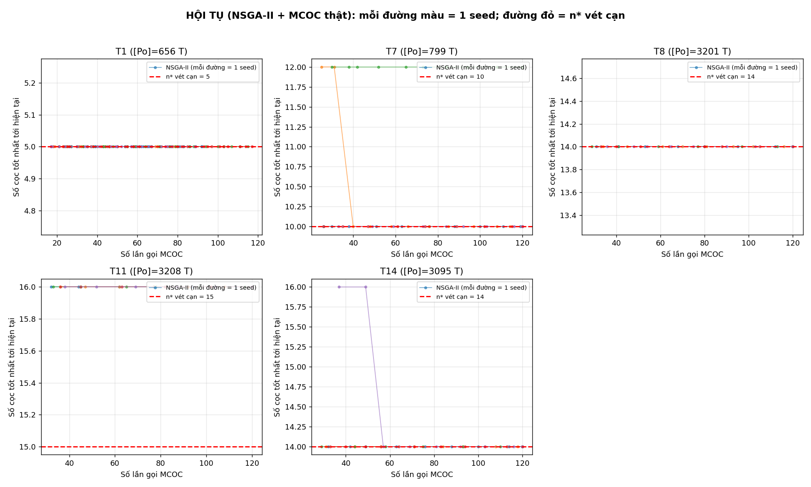
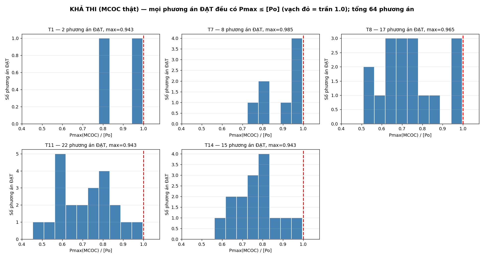
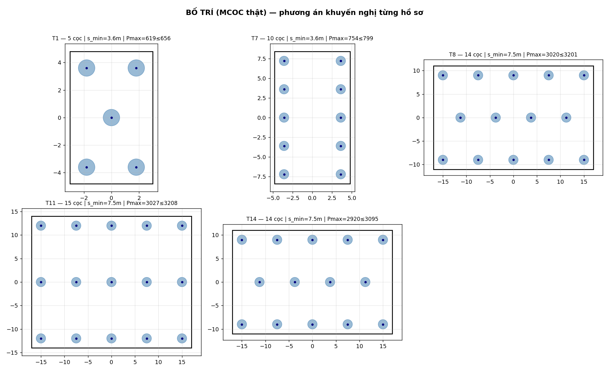
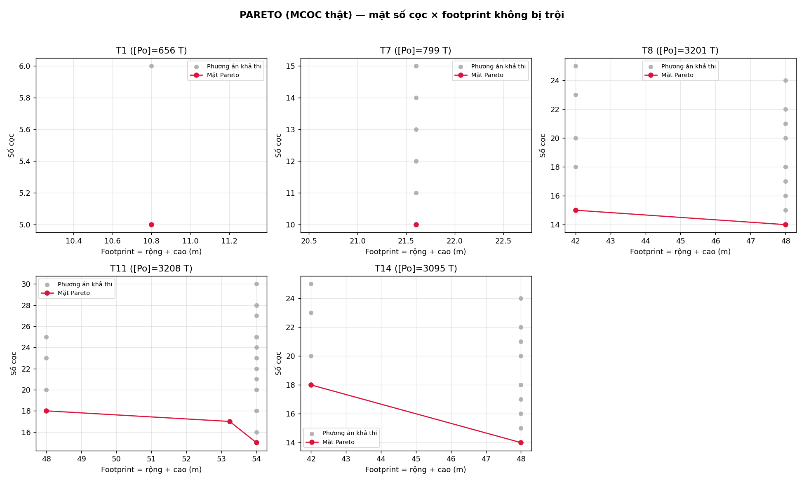
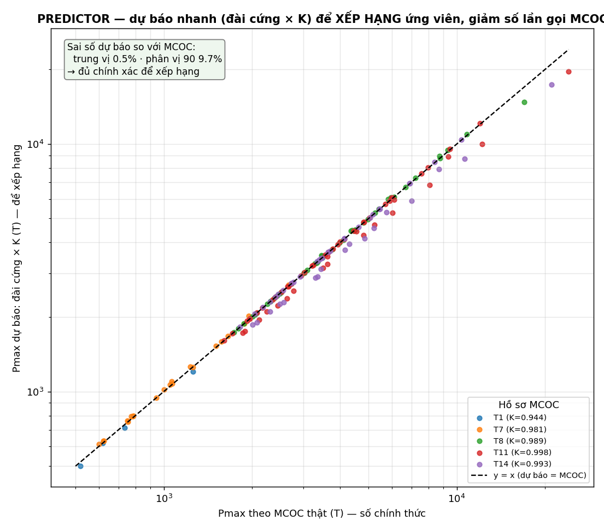
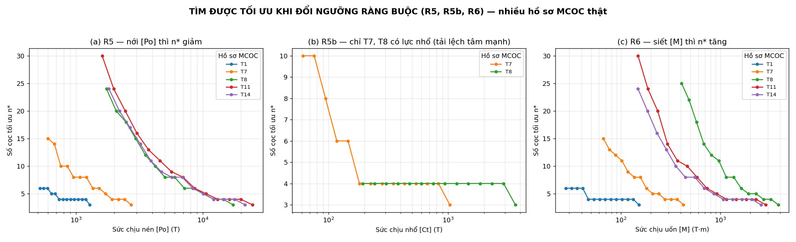

# BÁO CÁO GIẢI THÍCH THUẬT TOÁN — OptApp (Tối ưu bố trí cọc móng cầu)

> Tài liệu giải thích **OptApp giải bài toán bố trí cọc như thế nào** — viết để người đọc lần đầu vẫn theo được: mỗi mục mở đầu bằng ý đời thường, rồi mới tới chi tiết kỹ thuật.
> Nội dung: ① bài toán · ② cách mô hình hóa · ③ cách giải · ④ kết quả · ⑤ độ phức tạp · ⑥ kiểm chứng độ tin cậy.
> Ứng dụng **OptApp v1.1.0** · Cập nhật 2026-06-16 · Mã nguồn Python 3 (xem *Phụ lục — Bản đồ mã nguồn*).

---

## 0. Bức tranh tổng thể (đọc mục này là nắm được ý chính)

**Bài toán.** Một trụ cầu cần đặt cọc xuống đất để đỡ tải. Cọc đắt, nên ta muốn **dùng càng ít cọc càng tốt** mà công trình vẫn an toàn (cọc không quá tải, không quá gần nhau, nằm gọn trong bệ). OptApp tự động tìm cách bố trí cọc thỏa điều đó.

**Ba thành phần của lời giải:**

| Thành phần | Vai trò | Tốc độ |
|---|---|---|
| **MCOC** (phần mềm tính móng cọc) | Tính nội lực thật trong cọc cho một cách bố trí. **Mọi số liệu giao nộp đều do MCOC tính.** | Chậm (~0,1–1 giây/lần gọi) |
| **NSGA-II** (giải thuật di truyền đa mục tiêu) | Bộ tối ưu chính: sinh và tiến hóa nhiều cách bố trí để tìm phương án ít cọc nhất. | — |
| **Công thức đài cứng** (predictor) | Mô hình ước lượng nhanh nội lực, dùng để xếp thứ tự ứng viên nhằm giảm số lần gọi MCOC. **Không thay MCOC.** | Rất nhanh (<1 ms) |

**Nguyên tắc bất biến:** số liệu giao nộp (nội lực, kết luận ĐẠT/KHÔNG) **luôn do MCOC tính** — bên thi công không chấp nhận kết quả xấp xỉ. Công thức đài cứng chỉ giúp *chạy nhanh hơn*, không quyết định kết quả.

**Hai mục tiêu** (đánh đổi nhau): ① ít cọc nhất; ② bệ gọn nhất (hoặc dự trữ an toàn lớn nhất). Vì hai mục tiêu mâu thuẫn nên lời giải là **một tập phương án đánh đổi** (mặt Pareto), kỹ sư chọn theo bối cảnh.

**Hai kiểu xếp cọc** được so sánh: **Kiểu A** (lưới thẳng hàng) và **Kiểu B** (so le, hoa mai).

---

## 1. BÀI TOÁN

### 1.1. Cho gì, tìm gì

Kỹ sư **cho trước**: kích thước bệ móng `Lx × Ly` (bệ — tức **đài cọc** theo TCVN 10304:2014; ở đây gọi "bệ" theo quy ước công trình cầu), đường kính cọc `d`, sức chịu tải của cọc (`[Po]` nén, `[Ct]` nhổ, `[M]` uốn — tùy chọn), và **các tổ hợp tải trọng** tác dụng lên đáy bệ (`N`, `Mx`, `My`…).

Cần **tìm**: số cọc và vị trí từng cọc, sao cho **ít cọc nhất** mà công trình vẫn an toàn.

### 1.2. Mô tả một cách bố trí bằng 5 con số

Nếu để máy tự rải tọa độ từng cọc thì dễ ra bố trí lệch lạc, không thi công được. Thay vào đó, ta quy ước **mọi cách bố trí đều là một lưới đối xứng quanh tâm bệ**, mô tả gọn bằng **5 con số**:

| Con số | Ý nghĩa | Phạm vi |
|---|---|---|
| `type` | kiểu lưới | A (thẳng hàng) hoặc B (so le) |
| `nx` | số cột | số nguyên |
| `ny` | số hàng | số nguyên |
| `sx` | bước cọc theo phương X | từ 3d đến 6d (m) |
| `sy` | bước cọc theo phương Y | từ 3d đến 6d (m) |

Từ 5 con số này, phần mềm tự sinh tọa độ cọc (luôn đối xứng quanh tâm bệ → lực phân bố đều nhất). Số cọc: Kiểu A có `n = nx·ny`; Kiểu B so le nên hàng lẻ bớt 1 cọc.

> Vì có cả số nguyên (`nx, ny`) lẫn số thực (`sx, sy`) nên đây là bài toán **vừa rời rạc vừa liên tục** — một lý do khiến nó khó (xem Mục 2.1).

### 1.3. Hai mục tiêu, đều muốn nhỏ nhất

- **Mục tiêu 1 — số cọc `n`:** ít cọc = tiết kiệm vật liệu và thi công (quan trọng nhất).
- **Mục tiêu 2 — phụ:** "bệ gọn" (cụm cọc nhỏ → tiết kiệm bê tông bệ, mặc định) **hoặc** "an toàn" (Pmax nhỏ → dự trữ lớn).

Hai mục tiêu **mâu thuẫn**: trải cọc rộng ra thì an toàn hơn nhưng bệ to hơn; gom sát thì bệ gọn nhưng lực đầu cọc tăng. Vì vậy lời giải không phải một điểm mà là **mặt Pareto** — tập các phương án mà không phương án nào tốt hơn ở *cả hai* mục tiêu.

> Định hướng này đúng tinh thần TCVN 10304:2014 Mục 8.7: *"…cố gắng sao cho số cọc trong nhóm là tối thiểu, khoảng cách… lớn nhất, tận dụng tối đa sức chịu tải của cọc."*

### 1.4. Sáu điều kiện phải thỏa (R1–R6)

Một cách bố trí chỉ được chấp nhận nếu thỏa **tất cả** các điều kiện sau:

| Mã | Điều kiện | Diễn giải đời thường |
|---|---|---|
| R1, R2 | có ≥ 1 cọc và ≥ 1 tổ hợp tải | tiền đề tối thiểu |
| R3 | `3d ≤ khoảng cách tim cọc ≤ 6d` | cọc không quá sát (3d) cũng không quá xa (6d) |
| R4 | cọc nằm trong bệ | `max\|x\| + lề ≤ Lx/2`, tương tự phương Y |
| R5 | `Pmax ≤ [Po]` | lực nén lớn nhất trên cọc không vượt sức chịu nén |
| R5b | `Pmin ≥ −[Ct]` | lực nhổ (kéo) không vượt sức chịu nhổ |
| R6 | `Mx, My ≤ [M]` | mômen đầu cọc không vượt sức chịu uốn (nếu khai báo) |

*(Lực ngang R7 và tương tác P–M R8 nằm ngoài đề bài nên tắt mặc định; khi chấm bằng MCOC thì MCOC đã tính 3D đầy đủ nên không mất an toàn.)*

> **Cơ sở tiêu chuẩn (TCVN 10304:2014):** R3 theo Mục 8.13 (*"khoảng cách… không bé hơn 3d"*; cọc khoan nhồi cần thông thủy ≥ 1 m); R5/R5b theo Mục 7.1.11 (`Nc,d ≤ Rc,d`, `Nt,d ≤ Rt,d`). **Ký hiệu tương ứng:** `[Po]↔Rc,d`, `[Ct]↔Rt,d`, `Pmax/Pmin↔Nc,d/Nt,d`.

### 1.5. Mô hình tính nội lực: MCOC (chính xác) và công thức đài cứng (ước lượng nhanh)

Trái tim của tối ưu là hàm đánh giá nội lực một cách bố trí → trả về (`Pmax, Pmin, Mxmax, Mymax`). Có **hai cách tính**:

**(a) MCOC — kết quả chính xác (mặc định khi chạy thật).** Phần mềm ghi cách bố trí thành file, gọi `MCOC_Batch.exe`, đọc lại nội lực. Đây là kết quả đầy đủ (kể cả nền đàn hồi, cọc xiên, lực ngang) và là **số chính thức**.

**(b) Công thức đài cứng — ước lượng nhanh (chỉ phụ trợ).** Giả thiết bệ tuyệt đối cứng, lực dọc mỗi cọc tính bằng công thức cổ điển của TCVN 10304:2014 Mục 7.1.13:

```
Pᵢ = N/n  +  (Mx − N·cy)·(yᵢ − cy)/Ix  +  (My − N·cx)·(xᵢ − cx)/Iy
```

với `(cx, cy)` là tâm nhóm cọc, `Ix = Σ(yᵢ−cy)²`, `Iy = Σ(xᵢ−cx)²` — tức "lực dọc chia đều `N/n`, cộng phần uốn tuyến tính quanh tâm". Tính tức thì (<1 ms) nhưng là **ước lượng**; sai số so với MCOC được bù bằng một hệ số hiệu chỉnh `K` (xem Mục 5.6).

> **Khẳng định quan trọng:** công thức đài cứng chỉ dùng để *xếp thứ tự* xem nên gọi MCOC cho cách bố trí nào trước (tiết kiệm thời gian). **Mọi số giao nộp vẫn do MCOC tính.** Đã kiểm: tải nhập trên giao diện thực sự được ghi vào file MCOC (nhân đôi N → Nmax đổi 2065,78 → 3464,73 T).

---

## 2. CÁCH GIẢI

### 2.1. Vì sao bài toán khó

- **"Hộp đen", không có công thức đạo hàm:** Pmax do MCOC tính, không có biểu thức trơn theo `(nx, ny, sx, sy)` → không dùng được các phương pháp cần gradient.
- **Vừa rời rạc vừa liên tục:** `type, nx, ny` rời rạc; `sx, sy` liên tục.
- **Đa mục tiêu mâu thuẫn:** cần cả một mặt Pareto, không phải một điểm.
- **Chấm điểm đắt:** mỗi lần gọi MCOC tốn ~0,1–1 s → phải hạn chế số lần gọi.
- **Nhiều cực trị địa phương:** đổi kiểu A↔B hay thêm/bớt một hàng làm số cọc nhảy bậc.

### 2.2. Lời giải: NSGA-II + MCOC + công thức đài cứng

OptApp dùng **NSGA-II** làm bộ tối ưu chính, **MCOC** tính nội lực chính thức, **công thức đài cứng** ước lượng nhanh để xếp thứ tự ứng viên:

- **NSGA-II** (Non-dominated Sorting Genetic Algorithm II, Deb 2002) mô phỏng tiến hóa: giữ một *quần thể* cách bố trí, chọn cái tốt làm "cha mẹ", **lai ghép + đột biến** ra "con", rồi giữ lại đời tốt nhất; lặp nhiều thế hệ. Bốn cơ chế lõi:
  1. **Xếp hạng không bị trội** — chia quần thể thành các lớp Pareto.
  2. **Khoảng cách chen chúc** — ưu tiên nghiệm ở vùng thưa, giữ đa dạng.
  3. **Chọn lọc theo hạng + độ thưa** — cha mẹ tốt được ưu tiên sinh sản.
  4. **Lai ghép, đột biến, giữ tinh hoa** (gộp cha + con rồi giữ phần tốt nhất).

- **Xử lý ràng buộc theo Deb:** gộp mọi vi phạm (Pmax>Po, khoảng cách ngoài [3d,6d], cọc lố mép…) thành một chỉ số vi phạm chuẩn hóa. Khi so hai phương án: *khả thi luôn thắng bất khả thi; hai bất khả thi thì cái vi phạm ít hơn thắng; hai khả thi thì so Pareto*. Không cần tinh chỉnh trọng số phạt thủ công.

- **Hai mẹo tiết kiệm lần gọi MCOC:** (i) **nhớ kết quả** — hai cách bố trí ra cùng một lưới thì chỉ gọi MCOC một lần; (ii) **trần ngân sách** — chặn số lần gọi tối đa (giao diện đặt ~50 lần).

### 2.3. Vì sao chọn NSGA-II

- Chỉ cần giá trị mục tiêu, **không cần đạo hàm** → hợp với hộp đen MCOC.
- Xử lý tự nhiên biến **vừa rời rạc vừa liên tục**.
- Trả về **cả mặt Pareto trong một lần chạy** → kỹ sư chọn theo bối cảnh.
- Cơ chế ràng buộc của Deb gọn, không cần tinh chỉnh trọng số.

### 2.4. So với các cách khác

| Cách | Ưu | Nhược | Vai trò |
|---|---|---|---|
| **Quét lưới (vét cạn)** | Đơn giản, tất định, duyệt cạn kiệt `(type, nx, ny)` | `sx, sy` phải cố định (lấy max) | Mốc đối chứng tối ưu + bản demo |
| **Tinh chỉnh Pareto (Refine)** | Đoán bằng đài cứng×K rồi chỉ gọi MCOC ứng viên hứa hẹn → **rất ít lần gọi** | Chỉ quanh vùng lân cận phương án gốc | Chế độ "Refine" tinh chỉnh bố trí có sẵn |
| **NSGA-II** | Đa mục tiêu, không gradient, cho cả mặt Pareto, thám hiểm toàn cục | Ngẫu nhiên (cần seed); không *đảm bảo* tối ưu tuyệt đối 1 lần chạy | **Thuật toán chính** (nút "Chạy tối ưu hóa") |
| Gradient / quy hoạch lồi | Hội tụ nhanh | Cần khả vi & lồi — **không** thỏa | Không dùng |

> **Chốt:** đường quyết định là **NSGA-II + MCOC**. Quét lưới (đoán bằng đài cứng) **không** dùng để quyết định — chỉ làm mốc đối chứng và tô heatmap. Mọi số giao nộp đều do MCOC chấm.

### 2.5. Quy trình đầu–cuối

```
(1) Nhập:  Lx, Ly, d, [Po], [Ct], [M] + các tổ hợp tải        (GUI hoặc file MCOC)
(2) Kiểm tra đầu vào: có ≥1 tổ hợp tải; có MCOC_Batch + file gốc
(3) Tạo quần thể cách-bố-trí ngẫu nhiên ban đầu
(4) Chấm điểm mỗi cách bố trí bằng MCOC → nội lực → tính vi phạm + mục tiêu
        (nhớ kết quả để không gọi MCOC trùng; đài cứng chỉ xếp thứ tự hỏi)
(5) Tiến hóa qua nhiều thế hệ: chọn cha → lai ghép → đột biến → giữ tinh hoa
        (dừng sớm khi chạm trần số lần gọi)
(6) Lọc mặt Pareto khả thi từ tất cả cách bố trí đã chấm
(7) Kiến nghị phương án ít cọc nhất → gọn/an toàn nhất; xuất bảng + báo cáo + biểu đồ
```

### 2.6. Nhanh mà vẫn chính xác

Đây là điểm cốt lõi: **tốc độ KHÔNG đến từ việc thay MCOC bằng công thức gần đúng**, mà từ việc **gọi MCOC ít lần hơn và song song hóa**. Một lần gọi MCOC ≈ 0,1–1 s (đo thật: bài T14, 22 cọc/12 tổ hợp ≈ 0,8–1,0 s) — đây là chi phí chi phối; mọi thứ khác chỉ ở mức mili-giây.

Năm đòn bẩy tốc độ (đều **giữ nguyên tính chính xác**):

| # | Đòn bẩy | Cơ chế | Trạng thái |
|---|---|---|---|
| 1 | **Nhớ kết quả (cache)** | Không gọi MCOC hai lần cho cùng một lưới | ✅ đã có |
| 2 | **Trần ngân sách + dừng sớm** | Chặn số lần gọi; dừng khi Pareto hết cải thiện | ✅ đã có (~50) |
| 3 | **Predictor (đài cứng) xếp thứ tự** | Đài cứng (<1 ms) chọn ứng viên hứa hẹn để gọi MCOC trước | ✅ đã có (Refine) |
| 4 | **Song song hóa lời gọi MCOC** | Chạy nhiều file MCOC trên nhiều lõi CPU | ⏳ khuyến nghị |
| 5 | **Cache bền ra đĩa** | Lần chạy sau dùng lại kết quả cũ | ⏳ khuyến nghị |

**Ước lượng thời gian** (~1 s/lần gọi): vét cạn lưới ~162 lần (~162 s); **NSGA-II + cache + ngân sách ~≤50 lần (~50 s, ~7 s nếu song song 8 lõi)**; Refine predict-verify ~10–25 lần.

---

## 3. KẾT QUẢ: SO SÁNH KIỂU A vs B & KIẾN NGHỊ

### 3.1. Ví dụ đánh đổi A↔B

Bệ `12×15 m`, `d=1 m`, `[Po]=400 T`, một tổ hợp `N=4000 T, Mx=1200, My=800 T·m` *(các số Pmax dưới đây lấy từ công thức đài cứng để minh họa quan hệ A/B; thực tế Pmax do MCOC quyết)*:

| Tiêu chí | Kiểu A (thẳng hàng) | Kiểu B (so le) |
|---|---|---|
| Lưới | 3 × 4 | 3 × 5 |
| **Số cọc** | **12** | 13 |
| Bước cọc sx, sy (m) | 5,00 / 4,33 | 5,00 / 3,25 |
| Pmax (T) | 381,0 | 356,9 |
| Thỏa Pmax ≤ 400 | ✅ | ✅ |
| Dự trữ an toàn | 19,0 T | **43,1 T** |

**Đọc kết quả:** Kiểu B trải cọc so le nên an toàn hơn ~6%, nhưng để giữ khoảng cách 3d–6d nó cần **thêm 1 cọc**. Vì tiêu chí số 1 là *ít cọc nhất* → **Kiểu A thắng**. (Trên bệ chật như 6×9,6 m, Kiểu B thường không có nghiệm khả thi, Kiểu A linh hoạt hơn.)

### 3.2. Quy tắc kiến nghị

1. **Ít cọc nhất** (ưu tiên số 1).
2. Bằng số cọc → chọn theo **mục tiêu phụ** (bệ gọn, mặc định; hoặc Pmax nhỏ).
3. Vẫn ngang nhau → **giữ phương án gốc** (đỡ xáo trộn thiết kế).

→ Ví dụ trên: kiến nghị **Kiểu A 3×4 = 12 cọc, Pmax = 381 T / [Po] = 400 T**.

### 3.3. Đầu ra của chương trình

- Bảng **tọa độ từng cọc** + nội lực của tổ hợp bất lợi nhất.
- **Mặt Pareto** các phương án đánh đổi (để kỹ sư cân nhắc).
- **Báo cáo kỹ thuật** (Markdown): số liệu vào, kiểm tra hình học, nội lực, hệ số sử dụng, tổ hợp chi phối, bảng R1–R8.
- **Biểu đồ** bố trí cọc tô màu theo mức tải.

---

## 4. ĐỘ PHỨC TẠP & KHẢ NĂNG MỞ RỘNG

Ký hiệu: `n` = số cọc; `K` = số tổ hợp tải; `P, G` = kích thước quần thể & số thế hệ của NSGA-II.

**Một lần chấm điểm:** công thức đài cứng cho mọi tổ hợp là `O(K·n)` (nhanh, tuyến tính); nút thắt là khoảng cách tim cọc nhỏ nhất `O(n²)` khi n lớn. Còn **một lần gọi MCOC** (~0,1–1 s) là chi phí chi phối thực tế và đã tính trọn K tổ hợp trong một lần gọi.

**Khi K tăng (nhiều tổ hợp tải):** MCOC xử lý mọi tổ hợp trong *một* lần gọi → số lần gọi không tăng theo K. **Mở rộng tốt.**

**Khi n tăng (bệ nhiều cọc):** số lần gọi MCOC **không tăng** theo n (vẫn ≤ trần ngân sách) → vẫn khả thi. Nút thắt duy nhất là `O(n²)` của khoảng cách tim cọc; với vài trăm cọc nên thay bằng cây k-d / lưới băm để hạ về `O(n log n)`.

| Yếu tố tăng | Ảnh hưởng | Đánh giá |
|---|---|---|
| `K` (tổ hợp tải) | MCOC gộp 1 lần gọi | **Tốt** (tuyến tính) |
| `n` (số cọc) | số lần gọi MCOC không đổi; chỉ nút thắt `O(n²)` cải thiện được | **Khá** |
| `P, G` (NSGA-II) | chi phí `O(G·P²)`, số lần gọi ≤ trần | **Điều khiển được** |

---

## 5. KIỂM CHỨNG ĐỘ TIN CẬY

**Ý tưởng:** mỗi tính chất "đúng" của lời giải được kiểm bằng một công cụ **độc lập** với bộ tối ưu — để kết luận không phải do bộ tối ưu "tự khen". Tám phép kiểm dưới đây đều chạy trên **dữ liệu MCOC thật** của **5 hồ sơ input thật** (`mcoc_input_sample/`), trải từ bệ nhỏ tới bệ lớn: **T1** (6×9,6 m), **T7** (9,6×16,8 m), **T8** (34×22 m), **T11** (34×28 m), **T14** (34×22 m).

Các file input để mặc định `[Po]=500, [Ct]=[M]=0`, nên "sức chịu thiết kế" `[Po]*` của mỗi hồ sơ được **suy từ nội lực MCOC thật** (cho n* nằm giữa dải + dự trữ ~6%). Tái lập: `tests/validate_mcoc.py` (Mục 5.1–5.4, 5.6, 5.7), `tests/validate_method.py` (Mục 5.5), `tests/sweep_constraints.py` (Mục 5.8).

**Bảng 5.1.** Tám phép kiểm và công cụ đối chứng (đều trên MCOC thật, 5 hồ sơ).

| Phép kiểm | Kiểm điều gì | Đối chứng độc lập |
|---|---|---|
| Mục 5.1 | Đạt tối ưu toàn cục | Vét cạn họ lưới + MCOC |
| Mục 5.2 | Lời giải khả thi | Nội lực MCOC + `check_layout` |
| Mục 5.3 | Mặt Pareto không bị trội | Định nghĩa trội theo từng cặp |
| Mục 5.4 | Ổn định theo seed | Thống kê 5 seed |
| Mục 5.5 | Liên kết MCOC trung thực | MCOC chạy thật |
| Mục 5.6 | Predictor (đài cứng) đáng tin | So với MCOC thật |
| Mục 5.7 | Thỏa cân bằng tĩnh | Đại số tuyến tính |
| Mục 5.8 | Đổi ngưỡng vẫn tìm được tối ưu | Vét cạn + MCOC trên 5 hồ sơ |

### 5.1. Đạt tối ưu toàn cục

**Cách kiểm:** vét cạn duyệt cạn kiệt họ lưới (chấm bằng MCOC) → số cọc nhỏ nhất `n*` của nó là tối ưu toàn cục (đây chính là chế độ grid-search của OptApp). So NSGA-II+MCOC với mốc đó:

**Bảng 5.2.** Số cọc tối ưu trên 5 hồ sơ MCOC thật.

| Hồ sơ | `[Po]*` (T) | n* (vét cạn + MCOC) | NSGA-II + MCOC (tốt nhất / 5 seed) |
|---|---|---|---|
| T1 | 656 | 5 | 5 |
| T7 | 799 | 10 | 10 |
| T8 | 3201 | 14 | 14 |
| T11 | 3208 | 15 | **16** |
| T14 | 3095 | 14 | 14 |

**Đọc kết quả:** vét cạn + MCOC đạt tối ưu trên **cả 5 hồ sơ**; NSGA-II chạm đúng tối ưu trên **4/5**. Riêng **T11 dừng ở 16 (hơn tối ưu 1 cọc)** — nghiệm 15 cọc của T11 là một **cấu hình "góc"** (Kiểu A 5×3, bước cọc cực đại, cọc sát mép bệ): vùng khả thi cực hẹp nên tìm kiếm ngẫu nhiên khó trúng, còn vét cạn (thử bước cực đại từng lưới) thì tìm ra. Đây là giới hạn đã biết của metaheuristic ở nghiệm góc, **không phải lỗi**.

> **Vì sao chắc chắn đó là tối ưu (lập luận cận dưới):** vét cạn duyệt *toàn bộ* không gian lưới nên `n*` là cận dưới đúng; NSGA-II tìm trong cùng không gian nên không thể ít cọc hơn `n*`. Khi NSGA-II trả về phương án khả thi đúng `n*` cọc thì nó *chính là* tối ưu. Vì vét cạn + MCOC luôn sẵn và luôn đạt tối ưu, có thể gieo nghiệm vét cạn vào NSGA-II để **đảm bảo** chạm tối ưu kể cả ở nghiệm góc.



**Hình 5.1.** Hội tụ NSGA-II + MCOC về `n*` vét cạn trên 5 hồ sơ — mỗi đường màu là một seed, đường đỏ nét đứt là `n*`; T11 dừng 1 cọc trên nghiệm tối ưu góc.

### 5.2. Lời giải khả thi

**Cách kiểm:** lấy mọi phương án mà bộ tối ưu gắn nhãn ĐẠT, dùng nội lực MCOC + bộ kiểm `check_layout` (đường tính độc lập) kiểm lại. **Kết quả: 64 phương án ĐẠT trên 5 hồ sơ, 0 vi phạm**; mọi tỷ số Pmax/[Po] đều dưới 1,0 (lớn nhất 0,985). Các điểm sát 1,0 là lời giải nằm đúng trên biên khả thi (tận dụng tối đa sức chịu).



**Hình 5.2.** Phân bố Pmax(MCOC)/[Po] của phương án ĐẠT — mỗi hồ sơ một ô riêng (vạch đỏ = trần 1,0).



**Hình 5.2b.** Bố trí khuyến nghị (tối ưu) của 5 hồ sơ — cọc nằm trong bệ (R4), khoảng cách hợp lệ (R3), Pmax(MCOC) ≤ [Po] (R5).

> **Một lỗi đã được phát hiện và sửa nhờ kiểm chéo:** ban đầu bộ lọc của NSGA-II chỉ ràng khoảng cách tim cọc *nhỏ nhất*, **bỏ sót đường chéo của Kiểu B** `√((sx/2)²+sy²)` (có thể tới ~6,7d > 6d) → vài phương án Kiểu B bị gắn nhãn ĐẠT sai. Đã sửa: kiểm khoảng cách theo cấu trúc lưới, đồng nhất với `check_layout`. Sau sửa không còn bất nhất; các mốc kiểm thử (Pmax 486,91 / 408,34 / 398,80 T) vẫn đúng.

### 5.3. Mặt Pareto không bị trội

**Cách kiểm:** xét từng cặp phần tử trên mặt Pareto của cả 5 hồ sơ — không phần tử nào bị một phần tử khác tốt hơn ở *cả hai* mục tiêu (số cọc và footprint). Trực quan: đường Pareto luôn là **biên dưới-trái** của đám phương án khả thi.



**Hình 5.3.** Mặt Pareto (số cọc × footprint) trên 5 hồ sơ — biên dưới-trái, không bị trội.

### 5.4. Ổn định theo seed

**Cách kiểm:** chạy 5 seed cho mỗi hồ sơ. Tập số cọc tối ưu: T1 {5}, T7 {10, 12}, T8 {14}, T11 {16}, T14 {14}. Bốn hồ sơ hội tụ tuyệt đối về một giá trị; T7 có 4/5 seed đạt 10, 1 seed lệch +2 — chạy vài seed rồi lấy tốt nhất là đủ kiểm soát.

### 5.5. Liên kết MCOC trung thực

**Cách kiểm:** ① chạy trực tiếp file gốc vs chạy qua khuôn mẫu của OptApp → cùng `Nmax = 519,63 T` (lệch 0,000); ② nhân đôi tải N → Nmax tăng 519,6 → 918,8 T (tỷ lệ 1,768, nhỏ hơn 2 vì mômen không nhân). Vậy khuôn mẫu OptApp không làm sai lệch số MCOC, và tải nhập thực sự tác động đúng.

### 5.6. Predictor (công thức đài cứng × K) đáng tin

Predictor = công thức đài cứng × hệ số hiệu chỉnh K, dùng để **xếp thứ tự** ứng viên trước khi gọi MCOC (giảm số lần gọi) — **không thay** MCOC.

**Vì sao đoán được?** Ba lẽ:
1. Công thức đài cứng (Mục 1.5) đã nắm **đúng phần vật lý chủ đạo** — phân phối lực dọc trục dưới bệ cứng; bệ trụ cầu rất cứng nên giả thiết này sát thực tế.
2. Phần MCOC tính thêm (tương tác đất–cọc, hiệu ứng nhóm, độ mềm bệ) là hiệu chỉnh **có hệ thống, gần tỉ lệ** với lực đài cứng, vì nó phụ thuộc chủ yếu vào tính chất cọc/đất (cố định cho một móng), ít phụ thuộc cách xếp cọc. Do đó **`Pmax(MCOC) ≈ K · Pmax(đài cứng)`** với K gần như hằng số cho một móng.
3. Nên chỉ cần đo K **một lần** ở bố trí gốc (nơi có cả hai số) rồi dùng lại cho mọi ứng viên.

**Bằng chứng (Hình 5.4):** K = 0,944–0,998 cho 5 hồ sơ — **gần 1**, tức đài cứng vốn đã sát MCOC (lệch ~1–6%), K chỉ tinh chỉnh nốt. Sai số dự báo so với MCOC: **trung vị 0,5%**, phân vị 90 = 9,7%. Mức đó **đủ để xếp thứ tự**; vì không hằng tuyệt đối nên dự báo **không** dùng làm số chính thức — mọi phương án ĐẠT vẫn được MCOC chấm lại.



**Hình 5.4.** Dự báo đài cứng × K (để xếp hạng) so với MCOC thật (số chính thức) trên 5 hồ sơ, trục log.

### 5.7. Thỏa cân bằng tĩnh

**Cách kiểm:** hệ phản lực đầu cọc phải cân bằng với tải ngoài (`ΣP = N`, tổng mômen phản lực = mômen tải). Kiểm trên bố trí khuyến nghị của 5 hồ sơ:

**Bảng 5.3.** Sai lệch cân bằng tĩnh của công thức đài cứng.

| Hồ sơ | \|ΣP − N\| | \|Σ(P·dy) − Mx_t\| | \|Σ(P·dx) − My_t\| |
|---|---|---|---|
| T1 | 0,0 | 0,0 | 2,3·10⁻¹³ |
| T7 | 0,0 | 1,4·10⁻¹³ | 3,6·10⁻¹² |
| T8 | 0,0 | 3,6·10⁻¹² | 0,0 |
| T11 | 0,0 | 1,5·10⁻¹¹ | 0,0 |
| T14 | 3,6·10⁻¹² | 0,0 | 1,8·10⁻¹¹ |

> **Kết luận:** sai lệch tuyệt đối cỡ 1e−13…1e−11; so với tải (N tới ~37.000 T) thì **tương đối ~1e−15**, tức bằng 0 về số học. Công thức đài cứng (TCVN Mục 7.1.13) thỏa chính xác cân bằng tĩnh, nên đúng định luật cơ học.

### 5.8. Đổi ngưỡng ràng buộc vẫn tìm được tối ưu

**Cách kiểm:** giữ nguyên hồ sơ, **đổi trực tiếp ba ngưỡng sức chịu** (nén [Po], nhổ [Ct], uốn [M]) trên cả 5 hồ sơ MCOC thật, xem số cọc tối ưu `n*` đổi thế nào. Với mỗi hồ sơ, đánh giá pool nội lực MCOC một lần rồi với mỗi ngưỡng lấy phương án ít cọc nhất còn thỏa.

**Bảng 5.4.** Số cọc tối ưu khi đổi ngưỡng (đơn vị [Po]/[Ct]: T; [M]: T·m).

| Hồ sơ | Bệ (m) | [Po]: dải → n* | [Ct] (nhổ) → n* | [M]: dải → n* |
|---|---|---|---|---|
| T1 | 6×9,6 | 520–1.257 → 6→3 | — (không nhổ) | 28–148 → 6→3 |
| T7 | 9,6×16,8 | 602–2.669 → 15→3 | tới −1.014 T → 10→3 | 66–416 → 15→3 |
| T8 | 34×22 | 1.739–16.960 → 24→3 | tới −3.580 T → 4→3 | 406–3.759 → 25→3 |
| T11 | 34×28 | 1.608–24.099 → 30→3 | — (không nhổ) | 148–2.812 → 30→3 |
| T14 | 34×22 | 1.819–21.070 → 24→3 | — (không nhổ) | 148–2.516 → 24→3 |



**Hình 5.5.** `n*` khi đổi (a) sức nén [Po] — 5 hồ sơ; (b) sức nhổ [Ct] — chỉ T7, T8 có lực nhổ; (c) sức uốn [M] — 5 hồ sơ. Mỗi hồ sơ một đường, trục ngưỡng theo log.

> **Kết luận:** trên cả 5 hồ sơ và cả ba ràng buộc, `n*` đổi rõ rệt (3 → 30 cọc) và **đơn điệu đúng**: nới sức chịu thì cần ít cọc hơn, siết lại thì cần nhiều cọc hơn cho tới khi vô nghiệm. Tại mọi giá trị còn thỏa được, bài toán luôn tìm được tối ưu khả thi. *(Lực nhổ chỉ phát sinh ở hồ sơ tải lệch tâm mạnh T7, T8; các hồ sơ khác toàn nén.)*

---

## 6. ĐỐI CHIẾU VỚI YÊU CẦU

| Yêu cầu | Đáp ứng |
|---|---|
| Ngôn ngữ tự chọn | Python 3 |
| Code rõ ràng, comment từng bước | docstring + comment tiếng Việt ở mọi module |
| Chạy với dữ liệu mẫu & nhập tùy ý | `run_demo.py`, `mcoc_input_sample/`, GUI |
| Mô hình hóa bài toán | Mục 1 |
| Thuật toán + tại sao + ưu/nhược | Mục 2 |
| Kết quả: so sánh 2 kiểu + kiến nghị | Mục 3 |
| Độ phức tạp & mở rộng | Mục 4 |
| Kiểm chứng độ tin cậy | Mục 5 (8 phép kiểm, dữ liệu MCOC thật) |

---

## Phụ lục — Bản đồ mã nguồn

| Vai trò | File | Hàm/điểm chính |
|---|---|---|
| Thuật toán chính NSGA-II | [`core/nsga2_optimizer.py`](../core/nsga2_optimizer.py) | `run_nsga2`, `evaluate`, `fast_non_dominated_sort`, `crowding_distance` |
| MCOC (hộp đen tính nội lực) | [`core/blackbox.py`](../core/blackbox.py) · [`core/mcoc_runner.py`](../core/mcoc_runner.py) · [`io_handlers/mcoc_writer.py`](../io_handlers/mcoc_writer.py) | `evaluate_layout`, `make_real_evaluator` |
| Công thức đài cứng (predictor) | [`core/rigid_cap.py`](../core/rigid_cap.py) | `pile_forces`, `calibration_factor` |
| Kiểm ràng buộc R1–R6 | [`core/mechanics.py`](../core/mechanics.py) | `check_layout` |
| Sinh tọa độ từ 5 con số | [`core/generator.py`](../core/generator.py) | `generate_coords` |
| Quét lưới (mốc đối chứng/demo) | [`core/optimizer.py`](../core/optimizer.py) | `run_optimization` |
| Tinh chỉnh Pareto (Refine) | [`core/refine_optimizer.py`](../core/refine_optimizer.py) | `solve_min_scale` |
| Báo cáo & biểu đồ | [`io_handlers/report_writer.py`](../io_handlers/report_writer.py) · [`ui/plot_canvas.py`](../ui/plot_canvas.py) | — |
| Kiểm chứng (Mục 5) | `tests/validate_mcoc.py` · `tests/validate_method.py` · `tests/sweep_constraints.py` | — |
