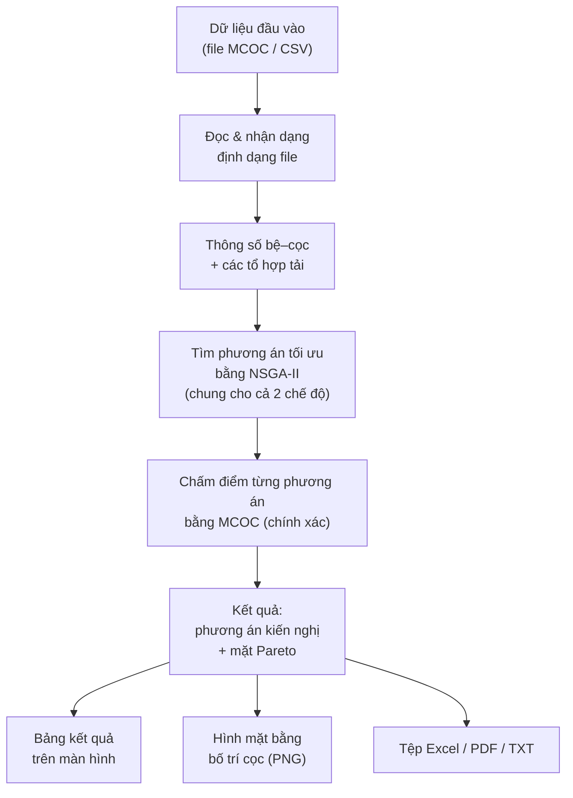
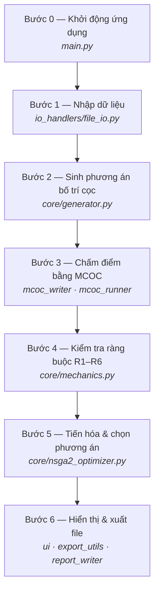
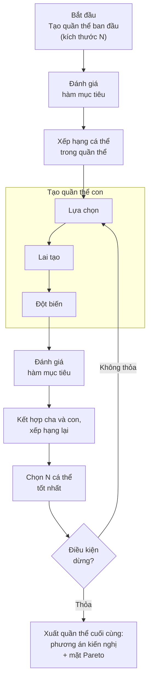
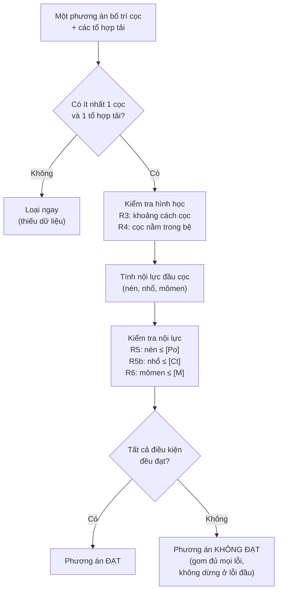
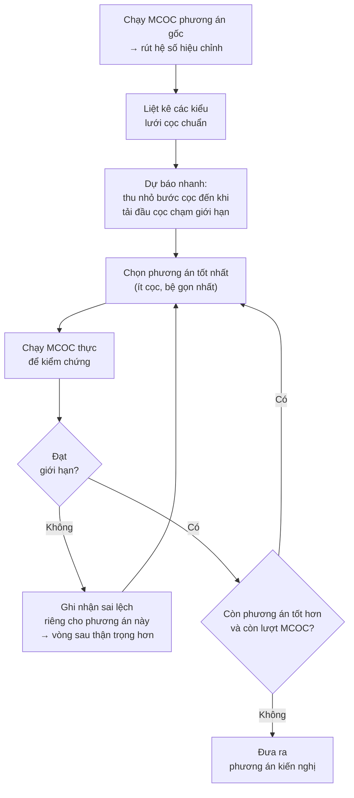

# 📘 TÀI LIỆU KỸ THUẬT DỰ ÁN: OptApp — Tối Ưu Hóa Bố Trí Cọc Móng Cầu

> **Phiên bản:** v1.10.0 (2026-06-28) — xem `CHANGELOG.md`. Nguồn version: `core/version.py`.
> **Tổ chức:** TEDI – Tổng Công ty Tư vấn Thiết kế GTVT
> **Ngôn ngữ:** Python 3.x
> **Giao diện:** Tkinter + TkinterDnD2
> **Mục tiêu:** Tự động tìm cấu hình bố trí cọc tối ưu (ít cọc nhất, đảm bảo tuyệt đối các ràng buộc kỹ thuật) cho móng cọc cầu đường bộ — đánh giá nội lực **bắt buộc bằng MCOC (chính xác)**.

---

## MỤC LỤC

1. [Bài toán & Đặt vấn đề](#1-bài-toán--đặt-vấn-đề)
2. [Kiến trúc tổng thể](#2-kiến-trúc-tổng-thể)
3. [Workflow chi tiết từng bước](#3-workflow-chi-tiết-từng-bước)
4. [Phương pháp giải quyết bài toán](#4-phương-pháp-giải-quyết-bài-toán)
5. [Giải thích từng module & hàm](#5-giải-thích-từng-module--hàm)
6. [Bảng Design Pattern](#6-bảng-design-pattern)
7. [Dữ liệu nhập tùy ý — Ví dụ chạy thực tế](#7-dữ-liệu-nhập-tùy-ý--ví-dụ-chạy-thực-tế)
8. [Định dạng file Input/Output](#8-định-dạng-file-inputoutput)
9. [Cài đặt & Chạy chương trình](#9-cài-đặt--chạy-chương-trình)

---

## 1. Bài toán & Đặt vấn đề

### 1.1 Bài toán gốc

Kỹ sư thiết kế cầu cần **bố trí cọc móng** cho mố/trụ cầu sao cho:

| Yêu cầu                        | Ý nghĩa                                                    |
| -------------------------------- | ------------------------------------------------------------ |
| **Ít cọc nhất**         | Tiết kiệm chi phí vật liệu, thi công                   |
| **Pmax ≤ Po**             | Lực nén đầu cọc không vượt sức chịu tải cho phép |
| **Pmin ≥ −Ct**           | Lực nhổ (kéo) không vượt giới hạn kéo               |
| **3d ≤ s ≤ 6d**          | Khoảng cách tim cọc đảm bảo tiêu chuẩn thi công     |
| **Tim cọc trong bệ**     | Tất cả cọc cách mép bệ ≥ 1 đường kính cọc        |
| **M ≤ Mmax** (tùy chọn) | Momen đầu cọc không vượt sức chịu uốn               |

### 1.2 Giải pháp cốt lõi (HIỆN HÀNH)

Bộ tối ưu chính là **NSGA-II (giải thuật di truyền đa mục tiêu)**; mỗi phương án được **chấm bằng MCOC chính xác** (gọi `MCOC_Batch.exe` như hộp đen). Cực tiểu đồng thời hai mục tiêu: **số cọc** và **mục tiêu phụ** (bệ gọn — mặc định, hoặc Pmax nhỏ). Kết quả là **mặt Pareto** để kiến nghị phương án.

> **Lưu ý:** công thức **bệ cứng** chỉ dùng phụ trợ (xem trước nhanh, tô heatmap, dự báo dẫn hướng cho Refine), **không** tham gia quyết định thiết kế. Mọi nội lực giao nộp đều do MCOC tính.

---

## 2. Kiến trúc tổng thể

```
OptApp/
├── main.py                     # Điểm khởi chạy ứng dụng
│
├── core/                       # Logic lõi (không phụ thuộc UI)
│   ├── nsga2_optimizer.py      # ENGINE CHÍNH — tối ưu đa mục tiêu NSGA-II
│   ├── mcoc_runner.py          # Chạy MCOC_Batch.exe (subprocess) & đọc kết quả
│   ├── blackbox.py             # Cầu nối đánh giá: gọi MCOC thực (hoặc mock xem trước)
│   ├── mechanics.py            # Kiểm tra ràng buộc hình học + nội lực (R1–R8)
│   ├── generator.py            # Sinh tọa độ lưới cọc (Kiểu A & B)
│   ├── refine_optimizer.py     # Tinh chỉnh Pareto + kiểm chứng MCOC (tính năng Refine)
│   ├── constants.py            # Hằng số & mặc định dùng chung (3d/6d, dải nx/ny…)
│   ├── rigid_cap.py            # Công thức bệ cứng (phụ trợ: heatmap, mock, dự báo)
│   ├── tcvn.py                 # TCVN 10304:2014: Rc,d (Đ.7.1.11), móng khối + lún (Đ.7.4.4)
│   ├── cap_design.py           # Thiết kế đài TCVN 5574:2018 (uốn/chọc thủng/cắt/STM)
│   ├── ssi_engine.py           # Tương tác đất–cọc (NumPy): dọc trục + ngang "m" + lún + nhóm
│   ├── cap_suggest.py          # Gợi ý nới bệ tối thiểu khi bệ chật
│   ├── ext/                    # Gói MỞ RỘNG (R7/R8, quét đường kính, thu bệ) — không sửa lõi
│   └── optimizer.py            # Quét lưới nhanh bằng bệ cứng (chỉ cho bản demo)
│
├── io_handlers/                # Xử lý dữ liệu vào/ra
│   ├── mcoc_writer.py          # Sinh file input MCOC từ template + tọa độ mới
│   ├── file_io.py              # Đọc CSV/TXT/MCOC; xuất TXT kết quả
│   ├── report_writer.py        # Báo cáo kỹ thuật (.md/.pdf): R1–R8, lún Đ.7.4.4, ngang Mục 6c
│   └── export_utils.py         # Xuất Excel, PDF, PNG
│
└── ui/                         # Giao diện — COMPOSITION (Plan 023)
    ├── main_window.py          # VỎ điều phối (~512 dòng): giữ state + dựng khung + delegator
    ├── controllers/            # Logic: params, loads, file_ops, results, simulation, optimization
    ├── tabs/                   # Dựng giao diện: interactive_tab, batch_tab
    ├── widgets/                # Tiện ích GUI: tooltip, widget_utils
    ├── constants.py, strings.py# Hằng số + nhãn UI dùng chung
    └── plot_canvas.py          # Vẽ mặt bằng/3D/SSI/đài (Matplotlib nhúng)
```

### Sơ đồ luồng dữ liệu



> **Luồng quyết định (chung cho Tab Tương tác và Hàng loạt):** nút "Chạy tối ưu hóa" gọi `run_nsga2()` với evaluator MCOC thực (`mcoc_writer` sinh input, `MCOC_Batch.exe` chạy, đọc `_result.txt`). Mỗi phương án chấm bằng MCOC. **Bắt buộc** cấu hình MCOC + file input gốc; thiếu thì từ chối chạy.
>
> Mô hình bệ cứng **không** nằm trên luồng này — chỉ tô heatmap khi hiển thị và làm bộ dự báo dẫn hướng.

---

## 3. Workflow chi tiết từng bước

Luồng thực thi khi bấm **"Chạy tối ưu hóa"** (chung cho Tab Tương tác và Hàng loạt):



### Bước 0 — Khởi động ứng dụng

**File:** `main.py` — kiểm tra thư viện `tkinterdnd2`, khởi tạo `MainWindow` (Tab Tương tác + Hàng loạt) rồi vào vòng lặp sự kiện Tkinter.

---

### Bước 1 — Nhập dữ liệu

**File:** `io_handlers/file_io.py` → `parse_input_file()`

Nhập bằng kéo–thả file (`.txt` chuẩn MCOC hoặc `.csv`) hoặc gõ tay trên UI. Hàm tự nhận dạng định dạng và trả về:

- **`params`** — kích thước bệ `L_X, L_Y`, đường kính `D_PILE`, sức chịu tải `P_LIMIT (Po)`, `P_TENSION (Ct)`, `M_LIMIT`; kèm tọa độ cọc gốc để dựng template MCOC.
- **`loads`** — danh sách tổ hợp tải `{Hx, Hy, N, Mx, My, Mz}` (đơn vị Tấn, T.m).

---

### Bước 2 — Sinh phương án bố trí cọc

**File:** `core/generator.py` → `generate_coords(nx, ny, sx, sy, layout_type)`

Mỗi phương án (một cá thể NSGA-II) mã hóa bởi `(kiểu lưới, nx, ny, sx, sy)`, rồi sinh tọa độ căn giữa gốc theo **2 kiểu lưới**:

- **Kiểu A — Trực giao:** lưới chữ nhật `nx × ny`.
- **Kiểu B — So le (hoa mai):** hàng lẻ dịch ngang `sx/2`; khoảng cách gần nhất giữa hai cọc là **đường chéo**.

(Công thức tọa độ chi tiết ở §5.1.)

---

### Bước 3 — Chấm điểm bằng MCOC

**File:** `io_handlers/mcoc_writer.py`, `core/mcoc_runner.py` (ghép qua `MCOCBlackbox.make_real_evaluator`)

Với mỗi phương án: `mcoc_writer` ghi tọa độ mới + tải từ UI vào **template MCOC**; `mcoc_runner` chạy `MCOC_Batch.exe`; đọc `_result.txt` lấy **Nmax, Nmin, Mxmax, Mymax** (số chính xác, đơn vị Tấn). Kết quả được **cache theo lưới** để không gọi MCOC trùng.

> Chế độ **mock** (công thức bệ cứng, `core/rigid_cap.py`) chỉ để xem trước nhanh khi chưa cấu hình MCOC — không dùng cho hồ sơ thiết kế.

---

### Bước 4 — Kiểm tra ràng buộc (R1–R6)

**File:** `core/mechanics.py` → `check_layout()` — gom toàn bộ lỗi rồi mới kết luận (không dừng ở lỗi đầu tiên):

| Mã | Loại | Điều kiện |
|---|---|---|
| R1, R2 | Tiền đề | Có ≥ 1 cọc và ≥ 1 tổ hợp tải |
| R3 | Hình học – Khoảng cách | A: `3d ≤ sx, sy ≤ 6d`; B: `3d ≤ sx, đường chéo ≤ 6d` |
| R4 | Hình học – Trong bệ | `max|x| + SAFE_D ≤ Lx/2` và `max|y| + SAFE_D ≤ Ly/2` |
| R5 | Nội lực – Nén | `Nmax ≤ [Po]` |
| R5b | Nội lực – Nhổ | `Nmin ≥ −[Ct]` (khi `Ct > 0`) |
| R6 | Nội lực – Uốn | `Mxmax, Mymax ≤ [M]` (khi `M > 0`) |

(Sơ đồ luồng `check_layout` ở §5.3.)

---

### Bước 5 — Tiến hóa & chọn phương án

**File:** `core/nsga2_optimizer.py` → `run_nsga2()`

NSGA-II tiến hóa quần thể qua nhiều thế hệ (lựa chọn, lai tạo, đột biến, chấm điểm bằng MCOC, xếp hạng Pareto), trả về **mặt Pareto** cân bằng giữa **số cọc** và **độ gọn của bệ**. Phương án kiến nghị là điểm tốt nhất trên mặt Pareto (ưu tiên ít cọc nhất, rồi bệ gọn nhất). Chi tiết thuật toán ở **§4.6**.

---

### Bước 6 — Hiển thị kết quả & Xuất file

**File:** `ui/main_window.py`, `ui/plot_canvas.py`, `io_handlers/export_utils.py`, `io_handlers/report_writer.py`

| Kênh xuất | Nội dung |
|---|---|
| Bảng trên màn hình | Phương án kiến nghị, mặt Pareto, bảng tọa độ cọc |
| Mặt bằng (Matplotlib) | Sơ đồ cọc tô màu nhiệt theo tỉ lệ N/[Po], kèm colorbar |
| TXT / Excel / PDF | Số liệu, tọa độ, nội lực từng tổ hợp |
| Báo cáo kỹ thuật (.md/.txt) | Hệ số sử dụng, tổ hợp chi phối, bảng R1–R6 |

Màu nhiệt mặt bằng: 🟢 thấp (an toàn) · 🟡 gần giới hạn · 🔴 vượt [Po] · 🟣 nhổ vượt [Ct].

---

## 4. Phương pháp giải quyết bài toán

### 4.0 Nguyên tắc CHÍNH XÁC BẮT BUỘC + chiến lược tốc độ

**Bên thi công chỉ nghiệm thu kết quả tính bằng MCOC, không chấp nhận xấp xỉ.** Do đó:

- **MCOC là oracle duy nhất:** tính hợp lệ (R3–R6) và mọi nội lực giao nộp (Pmax, Pmin, M) đều là số MCOC.
- **Tốc độ KHÔNG đến từ việc thay MCOC bằng mô hình xấp xỉ**, mà từ: (I) **giảm số lần gọi MCOC** và (II) **chạy song song** các lần gọi còn lại.
- Công thức **bệ cứng** chỉ là *heuristic dẫn hướng* (xếp hạng ứng viên, giải nhị phân bước cọc) + tô **heatmap**; nó ảnh hưởng **thứ tự** duyệt chứ không ảnh hưởng kết quả, nên tắt được mà không đổi tính đúng đắn.

**Năm đòn bẩy tốc độ (đều giữ nguyên tính chính xác):** (1) **cache theo lưới** — không gọi MCOC trùng (`spec_key`); (2) **trần `max_evals` + dừng sớm**; (3) **dẫn hướng bằng predictor rẻ** (<1 ms) để chọn ứng viên gửi MCOC trước; (4) **song song hóa** lời gọi `MCOC_Batch` trên nhiều lõi *(khuyến nghị nâng cấp — hiện chạy tuần tự)*; (5) **cache bền ra đĩa** cho lần chạy lại *(khuyến nghị)*.

Chi phí 1 lần MCOC ≈ 0.1–1 s (đo thật: T14 22 cọc/12 tổ hợp ≈ 0.8–1.0 s). Với NSGA-II + cache + `max_evals=50`: ~≤50 lần gọi ≈ 50 s tuần tự, ~7 s nếu song song 8 lõi. Phân tích đầy đủ: `docs/BAO_CAO_THUAT_TOAN.md §2.6`.

### 4.1 Tổng quan phương pháp

**Đường HIỆN HÀNH (mặc định):**

| Giai đoạn | Phương pháp | Lý do lựa chọn |
|---|---|---|
| Tìm kiếm nghiệm | **NSGA-II (di truyền đa mục tiêu)** | Hộp đen không đạo hàm, biến hỗn hợp rời rạc–liên tục, đa mục tiêu mâu thuẫn → cần mặt Pareto |
| Đánh giá nghiệm | **MCOC exact** (hộp đen) | Kết quả chính xác cho từng phương án; tải lấy từ UI |
| Xử lý ràng buộc | **Constrained-domination (Deb)** | Gộp vi phạm chuẩn hóa; không cần trọng số phạt thủ công |
| Kiểm soát chi phí | **Cache theo lưới + `max_evals`** | Giới hạn số lần gọi MCOC (đắt) |
| Chọn kết quả | **Ưu tiên từ điển trên mặt Pareto** | ít cọc → bệ gọn / Pmax nhỏ |

### 4.2 Công thức bệ cứng — chỉ dùng phụ trợ

`core/rigid_cap.py` là nguồn duy nhất của công thức **đài cứng** (bệ cứng). Nó **không** tham gia quyết định thiết kế, chỉ phục vụ tô **heatmap**, chế độ **mock** (xem trước khi chưa cấu hình MCOC) và **dự báo dẫn hướng** trong Refine. Đây đúng công thức tải trọng lên cọc của đài cứng trong **TCVN 10304:2014 §7.1.13 (công thức (4))** — *"xem móng cọc như kết cấu khung, các cọc thẳng đứng cùng tiết diện liên kết bằng đài cứng"*. Lực dọc trục trên cọc thứ *i* (tải `N` đặt tại gốc tọa độ, **dời mômen về trục trọng tâm nhóm cọc**):

```
Pᵢ = N/n + (Mx − N·cy)·(yᵢ − cy)/Ix + (My − N·cx)·(xᵢ − cx)/Iy
```

với `cx, cy` là tâm nhóm cọc, `Ix = Σ(yᵢ−cy)²`, `Iy = Σ(xᵢ−cx)²` (xem [`rigid_cap.pile_forces`](core/rigid_cap.py:21)); tương đương dạng `Nⱼ = N/n ± Mx·yⱼ/Σyᵢ² ± My·xⱼ/Σxᵢ²` của tiêu chuẩn. **Ký hiệu** (TCVN 10304:2014): `[Po] ↔ Rc,d` (sức chịu tải trọng nén), `[Ct] ↔ Rt,d` (sức chịu tải trọng kéo), `Pmax/Pmin ↔ Nc,d/Nt,d` (tải trọng nén/kéo lên cọc).

> **Quan trọng (đã sửa):** code **luôn trừ `N·cy`, `N·cx`** để cân bằng mômen kể cả khi trọng tâm nhóm cọc **lệch** khỏi gốc. Điều này cần cho **Kiểu B với `ny` chẵn** (vd `nx=3, ny=2` → `cy = −0.36 m ≠ 0`): nếu bỏ số hạng dời tâm sẽ sai Pmax tới ~15%. Kiểu A và Kiểu B `ny` lẻ có `cx=cy=0` nên hai dạng công thức trùng nhau. *(Tài liệu cũ từng ghi "vì lưới đối xứng nên số hạng chuyển momen triệt tiêu" — không đúng cho Kiểu B `ny` chẵn; code thực tế đã xử lý đúng.)*

Tính tức thì (<0.1 ms) nhưng là **ước lượng** — mọi số giao nộp vẫn lấy từ MCOC.

---

### 4.6 Tối ưu đa mục tiêu bằng NSGA-II — ENGINE CHÍNH (`core/nsga2_optimizer.py`)

Đây là **bộ tối ưu mặc định** của ứng dụng (Non-dominated Sorting Genetic Algorithm II, Deb et al. 2002). Khác Refine (vòng lặp tất định), NSGA-II tiến hóa một **quần thể** phương án và trả về **toàn bộ mặt Pareto** cân bằng giữa số cọc và mục tiêu phụ. Nút "Chạy tối ưu hóa" gọi engine này với evaluator **MCOC exact**.

> **Kiểm chứng độ tin cậy** (đạt tối ưu so với vét cạn, khả thi, Pareto, ổn định, cân bằng tĩnh, đổi ngưỡng ràng buộc) được thực hiện trên **dữ liệu MCOC thật của 5 hồ sơ input** (`mcoc_input_sample/`); chi tiết và biểu đồ ở `docs/BAO_CAO_THUAT_TOAN.md §5` (tái lập: `tests/validate_mcoc.py`, `tests/sweep_constraints.py`).

**Biến quyết định (genome) — mã hóa 1 phương án lưới:**

| Gene   | Kiểu        | Miền                    | Ý nghĩa                       |
| ------ | ----------- | ------------------------ | ------------------------------- |
| `type` | rời rạc    | {A, B}                   | Lưới trực giao / hoa mai      |
| `nx`   | nguyên     | [1, nmax]                | Số cột                         |
| `ny`   | nguyên     | [1, nmax]                | Số hàng                        |
| `sx`   | liên tục  | [3d, 6d]                 | Bước lưới theo X               |
| `sy`   | liên tục  | [3d, 6d]                 | Bước lưới theo Y               |

`nmax` được suy ra từ kích thước bệ (sao cho bước ≥ 3d), cắt trần ở 14. `decode()` sửa chữa genome (Kiểu B ≥ 2×2, kẹp `sx,sy` theo mép bệ) rồi sinh tọa độ qua `grid_coords()`.

**Hai mục tiêu (đều cực tiểu hóa):** `f₁ = số cọc`; `f₂ = mục tiêu phụ` — **footprint/"bệ gọn"** (mặc định) hoặc **Pmax** ("an toàn"), chọn qua tham số `secondary` / trên giao diện.

**Xử lý ràng buộc — nguyên tắc "constrained-domination" (Deb):** gộp toàn bộ vi phạm (Pmax > Po, Pmin < −Ct, khoảng cách ngoài [3d, 6d], cọc vượt mép bệ, momen vượt Mmax) thành một chỉ số vi phạm `CV` đã chuẩn hóa. So sánh hai cá thể: *khả thi luôn trội hơn bất khả thi; hai bất khả thi thì CV nhỏ hơn trội hơn; hai khả thi thì so Pareto trên (f₁, f₂)*.

**Bốn thành phần lõi NSGA-II:**

1. **Fast non-dominated sorting** — xếp hạng các cá thể thành các "front" Pareto.
2. **Crowding distance** — đo mật độ trên mặt Pareto để giữ đa dạng nghiệm.
3. **Crowded-comparison tournament** — chọn lọc theo (rank thấp hơn → crowding lớn hơn).
4. **SBX crossover + polynomial mutation + elitism (μ+λ)** — sinh con và giữ tinh hoa qua việc gộp cha+con rồi cắt theo rank/crowding.

**Vòng lặp tiến hóa NSGA-II (một thế hệ):**



**Đánh giá nội lực — exact hay mock:**

```python
# Mock (không cần MCOC) — nhanh, để xem trước:
res = run_nsga2(params, loads, pop_size=40, n_gen=30)

# MCOC EXACT — số liệu thật, không xấp xỉ:
from core.blackbox import MCOCBlackbox
params['exe_path'] = r"...\MCOC_Batch.exe"
params['input_filepath'] = r"...\T1_EXT.txt"
evaluator = MCOCBlackbox.make_real_evaluator(params)
res = run_nsga2(params, loads, evaluator=evaluator,
                pop_size=20, n_gen=10, max_evals=60)
```

Mỗi genome chỉ gọi evaluator **một lần** nhờ **cache theo `spec_key`** (GA thường xét lại cùng cấu hình); `max_evals` đặt trần số lần chạy MCOC để kiểm soát thời gian. Kết quả trả về tương thích với `run_optimization` (`recommended`, `all_valid_configs`, `best_A/B`) và bổ sung `pareto_front`, `n_evals`, `eval_mode`.

> **Kiểm chứng:** với bộ dữ liệu mẫu (bệ 6×9.6 m, d=1.2 m, Po=500 T), NSGA-II hội tụ về phương án **Kiểu A 2×3, 6 cọc, Pmax ≈ 486.9 T** — xem `python run_nsga2_demo.py` và `python tests/test_nsga2.py`.

**So sánh hai engine tối ưu (đều chấm bằng MCOC):**

| Engine                  | Thuật toán                      | Mặt Pareto | Khi nào dùng                              |
| ----------------------- | --------------------------------- | ----------- | ------------------------------------------- |
| `nsga2_optimizer`     | **NSGA-II (di truyền)**     | **Đầy đủ** | Engine chính — tối ưu đa mục tiêu, khảo sát trade-off |
| `refine_optimizer`    | Pareto tất định (predict–verify) | Một phần | Tinh chỉnh từ phương án gốc, tiết kiệm lần gọi MCOC |

---

### 4.7 Mở rộng mô hình: lực ngang, thông thủy, tương tác P–M

> **Lưu ý:** đề bài chỉ yêu cầu **R1–R6**. R7 (lực ngang), R8 (tương tác P–M) và ràng buộc thông thủy là **phần mở rộng tùy chọn, TẮT mặc định** (`ENABLE_LATERAL_CHECK=False`, `ENABLE_PM_INTERACTION=False` trong `core/constants.py`). Ở chế độ MCOC, lực ngang/3D đã được MCOC tính đầy đủ nên tắt R7/R8 không làm mất an toàn.

Để bám sát yêu cầu kỹ thuật (TCVN 10304:2014 / TCVN 11823), mô hình **có thể bật** bổ sung:

**Phân phối lực ngang Hx, Hy, Mz** (`rigid_cap.horizontal_forces`) — trước đây bệ cứng chỉ phân phối lực dọc trục, bỏ qua Hx, Hy, Mz dù người dùng có nhập. Nay với giả thiết cọc đứng độ cứng ngang bằng nhau:

```
Hxi = Hx/n − Mz·(y_i−cy)/Ip
Hyi = Hy/n + Mz·(x_i−cx)/Ip      ;  Ip = Ix + Iy
H_i = √(Hxi² + Hyi²)
```

`Hmax` = max H_i trên mọi cọc × mọi tổ hợp. *Lưu ý:* momen thân cọc do tải ngang vẫn cần phân tích p‑y riêng — đây chỉ là phân phối tĩnh học để kiểm sơ bộ với [H].

**Ràng buộc bổ sung:**

| Mã | Điều kiện | Bật khi |
| --- | --- | --- |
| **R7** | `Hmax ≤ [H]` | `H_LIMIT > 0` |
| **R8** | tương tác nén–uốn `Pmax/[Po] + Mmax/[M] ≤ 1` | có cả `[Po]` và `[M]` |
| **Thông thủy** | khoảng cách tim–tim `≥ max(3d, d + thông_thủy)` | `CLEAR_MIN > 0` (đặt 1.0 cho cọc khoan nhồi) |

> **Lưu ý tiêu chuẩn:** cận dưới **3d** là yêu cầu TCVN 10304:2014 (cọc ma sát); cọc khoan nhồi còn cần **thông thủy ≥ 1 m**. Cận trên **6d không phải giới hạn tiêu chuẩn** mà là quy ước thực hành (giữ giả thiết bệ cứng + bệ hiệu quả). **Từ v1.3.0:** 6d hạ cấp thành **cảnh báo mềm** (`ENFORCE_SPACING_MAX=False`) — vẫn là cận tìm kiếm nhưng không loại phương án vượt 6d.

> **Sức chịu tải thiết kế (TCVN 10304:2014 Điều 7.1.11) — v1.3.0:** `core/tcvn.py` là nguồn duy nhất tính `Rc,d = (γ0/γn)·(Rc,k/γk)`. Khai báo `R_C_K` + `GAMMA_0`/`GAMMA_N`(hoặc `IMPORTANCE_LEVEL`)/`GAMMA_K` thì `[Po]`/`[Ct]` tự thành `Rc,d`/`Rt,d`; không khai báo thì `[Po]` nhập tay được coi đã là `Rc,d`. Module còn có `equivalent_block` (móng khối quy ước, Điều 7.4) và `settlement` (lún, Phụ lục C) — kích hoạt khi có số liệu địa chất (`pile_length`, `phi_tb`, `soil_below`, `S_LIMIT`), in ở **mục 6b** của báo cáo. **OptApp chỉ phủ TTGH I theo lực dọc trục**; sức chịu tải theo vật liệu, nhóm cọc/lún (7.4) và tải ngang (Phụ lục A) phải kiểm riêng — báo cáo nêu rõ.

`nsga2_optimizer` và `refine_optimizer` dùng chung `core.rigid_cap` nên ràng buộc áp dụng nhất quán. Báo cáo kỹ thuật (`io_handlers/report_writer.py`) in bảng ràng buộc **R1–R6** kèm **hệ số sử dụng** và **tổ hợp chi phối** (thêm R7/R8 chỉ khi bật); mẫu xem `docs/ban_output_chuan_ky_thuat.md`.

---

## 5. Giải thích từng module & hàm

### 5.1 `core/generator.py`

#### `generate_coords(nx, ny, sx, sy, layout_type) → np.ndarray`

**Mục đích:** Sinh mảng tọa độ `[x, y]` của các đầu cọc, căn giữa tại gốc tọa độ (0, 0).

**Thuật toán:**

```python
# Kiểu A (Trực giao)
for j in range(ny):
    y = (j - (ny-1)/2.0) * sy     # Căn giữa theo Y
    for i in range(nx):
        x = (i - (nx-1)/2.0) * sx  # Căn giữa theo X
        coords.append([x, y])

# Kiểu B (So le)
for j in range(ny):
    y = (j - (ny-1)/2.0) * sy
    cols = nx if (j % 2 == 0) else (nx - 1)
    offset = -(cols-1)/2.0 * sx   # Dịch chuyển để căn giữa
    for i in range(cols):
        x = offset + i * sx
        coords.append([x, y])
```

**Ví dụ (nx=3, ny=2, sx=2.0, sy=3.0, Kiểu A):**

```
(-2.0, 1.5)  (0.0, 1.5)  (2.0, 1.5)
(-2.0,-1.5)  (0.0,-1.5)  (2.0,-1.5)
```

---

### 5.2 `core/blackbox.py`

`MCOCBlackbox` là cầu nối đánh giá một phương án bố trí cọc.

#### `make_real_evaluator(params, loads=None) → evaluator(coords) → dict`

Ghép `mcoc_writer` + `mcoc_runner` thành hàm `evaluator(coords)` chạy MCOC thực, trả về `{pmax, pmin, mxmax, mymax}` (Tấn). Đây là evaluator truyền vào `run_nsga2` và `run_pareto_refinement`.

#### Chế độ mock (xem trước)

Khi chưa cấu hình MCOC, `evaluate_layout()` dùng bệ cứng (`core/rigid_cap.py`) nhân hệ số hiệu chỉnh `K = Pmax_MCOC(gốc) / Pmax_bệ_cứng(gốc)` để ước lượng nhanh — chỉ để xem trước, không dùng cho hồ sơ.

> **Hạn chế của mock (chỉ ảnh hưởng xem trước, KHÔNG ảnh hưởng hồ sơ vì hồ sơ dùng MCOC):**
> - **Mômen đầu cọc** ở mock ước lượng bằng heuristic `Mx ≈ Mx_gốc · (n_gốc / n)` (tỉ lệ nghịch số cọc), **không** suy ra từ cơ học bệ cứng (bệ cứng chỉ cho lực dọc trục, không cho mômen thân cọc). Vì vậy nếu bật kiểm tra `[M]` (R6) ở **chế độ mock**, độ tin cậy R6 thấp hơn R1/R2; chỉ nên tin R6 khi chấm bằng **MCOC**. Chương trình **tự cảnh báo** khi chạy mock với `[M] > 0` (`run_nsga2` ghi log "CANH BAO…"; `run_optimization` trả về trường `warning` và `run_demo.py` in ra).
> - Hệ số `K` trích từ phương án gốc (thường đối xứng) rồi nhân cho mọi phương án: chỉ co giãn theo tỉ lệ, **không** sửa được khác biệt cấu trúc ở layout lệch tâm. Vì vậy mock chỉ để xem trước.

---

### 5.3 `core/mechanics.py`

#### `check_layout(coords, nx, ny, sx, sy, layout_type, params, loads) → tuple`

**Luồng xử lý (gom lỗi, KHÔNG dừng ở lỗi đầu tiên):**



---

### 5.4 `core/optimizer.py` — quét lưới nhanh (chỉ cho bản demo)

`run_optimization(params, loads)` quét toàn bộ lưới A/B bằng bệ cứng, trả về `recommended`, `all_valid_configs`, `best_A/B`, `original_config`. **Chỉ dùng cho `run_demo.py`** (xem nhanh, không cần MCOC); không nằm trên luồng quyết định thiết kế.

> **Ràng buộc đường chéo Kiểu B (ĐÃ SỬA):** ràng buộc gần nhất của Kiểu B là **đường chéo** `√((sx/2)² + sy²)`, ở bước lớn nhất thường vượt 6d (vd `sx=sy=6d → diag≈6.7d`). Trước đây demo đặt `sy=sy_max` cố định nên nhiều Kiểu B bị **loại oan**. Nay demo **giảm `sy`** xuống `√(36d² − (sx/2)²)` để kéo đường chéo về đúng 6d (vẫn giữ `sy` lớn nhất, mômen quán tính lớn), nên Kiểu B được khảo sát đầy đủ (đã kiểm: tìm được nhiều phương án B với `diag ∈ [3d,6d]`). Engine quyết định **NSGA-II** không vướng lỗi này vì tối ưu `sx, sy` liên tục và đo khoảng cách bằng `min_spacing` thực.

---

### 5.4b `core/refine_optimizer.py` — Tinh chỉnh Pareto + MCOC thực

Module này hiện thực **đường tính toán thứ hai** (tính năng *Refine* trên UI), khác `optimizer.py` (quét lưới nhanh bằng mock): nó **gọi MCOC thực** để kiểm chứng thay vì chỉ ước lượng.

#### `run_pareto_refinement(params, loads, evaluator, log, budget=25) → dict`

Hàm chính do `ui/main_window.run_refine_real()` gọi. Nguyên tắc *predict – verify – recalibrate*:

1. Gọi MCOC cho phương án gốc → hệ số hiệu chỉnh toàn cục `K = Pmax_MCOC / Pmax_bệ_cứng`.
2. Liệt kê toàn bộ họ lưới chuẩn (`enumerate_configs`); với mỗi cấu hình, dùng `solve_min_scale()` (binary search) tìm hệ số co nhỏ nhất sao cho **dự báo** `K × Pmax_bệ_cứng ≤ target` (mặc định `0.99 × P_LIMIT`).
3. Lấy ứng viên tốt nhất trên mặt Pareto **(số cọc, độ gọn bệ = footprint)**, gọi MCOC thực kiểm chứng. Nếu KHÔNG ĐẠT thì lưu hệ số hiệu chỉnh **riêng** cho cấu hình đó (`cfg_K`) để vòng sau tự đẩy lùi dự báo.
4. Lặp đến khi không còn ứng viên trội hơn phương án đương nhiệm, hoặc cạn `budget` lần gọi MCOC.



> Tiêu chí "tốt hơn" ở đây là **(ít cọc hơn) → (cùng số cọc nhưng bệ gọn hơn)**, hơi khác `optimizer.py` (ít cọc → Pmax nhỏ hơn).

#### `run_refinement(...)` — biến thể tinh chỉnh từng bước (greedy)

Tinh chỉnh cục bộ quanh lưới gốc bằng các bước rời rạc: co `sx`/`sy` một nấc, bỏ 1 cột, bỏ 1 hàng, hoặc chuyển lưới A sang hoa mai B. Được dùng trong `tests/test_refine.py`.

#### Hàm phụ trợ

`detect_grid()` nhận diện lưới A/B từ tọa độ gốc; `min_spacing()` (cũng được `mechanics.py` dùng lại cho nhánh "Gốc"); `grid_coords()`, `footprint()`, `check_constraints()`.

---

### 5.4c `core/mcoc_runner.py` & `io_handlers/mcoc_writer.py` — Cầu nối MCOC thực

- **`MCOCTemplate` (`mcoc_writer.py`):** đọc file input MCOC gốc làm template, tự nhận diện khối tọa độ cọc (`_detect_layout`), rồi `write(coords, out_path)` sinh file input mới với bộ tọa độ tối ưu (vá lại header số cọc qua `_patch_header`).
- **`MCOCRunner` (`mcoc_runner.py`):** `run(input_filepath)` chạy `MCOC_Batch.exe <input> --out-dir ...` qua `subprocess`, chờ kết thúc, tìm file `*_result.txt` rồi parse Nmax/Nmin/Mxmax/Mymax bằng `parse_mcoc_result_file()`. Hỗ trợ `exe_path` là `.exe/.bat/.py/.lnk` (tự resolve shortcut trên Windows).

`MCOCBlackbox.make_real_evaluator()` (trong `blackbox.py`) ghép hai module này thành `evaluator(coords) → dict` — chính là `evaluator` truyền vào `run_pareto_refinement` **và** `run_nsga2`.

---

### 5.4d `core/nsga2_optimizer.py` — Tối ưu đa mục tiêu NSGA-II

Cơ sở lý thuyết và toán tử đã trình bày ở §4.6. Các hàm chính:

#### `run_nsga2(params, loads, evaluator=None, pop_size=40, n_gen=30, seed=0, max_evals=None) → dict`

Vòng lặp NSGA-II hoàn chỉnh: khởi tạo quần thể ngẫu nhiên, rồi lặp `n_gen` thế hệ (tournament → SBX → mutation → đánh giá → gộp cha+con → non-dominated sort + crowding → chọn lọc μ+λ). Trả về `recommended`, `pareto_front`, `all_valid_configs`, `n_evals`, `eval_mode`. Nếu `evaluator=None` thì tự dùng mock (`make_mock_evaluator`); truyền evaluator MCOC thực để đánh giá exact.

#### Các hàm thành phần

- `decode(ind, params)` — giải mã genome → (spec lưới, tọa độ), có sửa chữa & kẹp biên.
- `evaluate(...)` — tính (f₁, f₂) và chỉ số vi phạm `CV`; **cache theo `spec_key`** để không gọi MCOC trùng.
- `fast_non_dominated_sort()`, `crowding_distance()` — hai khối lõi xếp hạng Pareto.
- `_constrained_dominates()` — toán tử trội có ràng buộc (Deb).
- `_tournament()`, `_crossover()` (SBX cho số thực/nguyên, hoán đổi cho `type`), `_mutate()` (polynomial cho `sx,sy`, ±1 cho `nx,ny`, lật `type`).

> **Lưu ý phụ thuộc:** module chỉ dùng `numpy` (tái sử dụng `grid_coords`, `min_spacing` từ `refine_optimizer`). **Không** cần `pymoo`/`deap`, giữ app nhẹ, dễ cài trên Windows.

---

### 5.5 `io_handlers/file_io.py`

#### `parse_input_file(filepath) → (params, loads, project_name)`

Tự động phát hiện format: CSV (dấu phẩy) hoặc TXT chuẩn MCOC.

#### `parse_mcoc_result_as_input(filepath) → (params, loads, project_name)`

Đọc file *kết quả* của MCOC làm *đầu vào* cho OptApp (trích xuất cả tọa độ cọc gốc, Pmax/Mxmax thực tế để calibration).

#### `parse_mcoc_result_file(filepath) → dict`

Đọc chính xác Nmax, Nmin, Mxmax, Mymax từ bảng tổng kết trong file kết quả MCOC.

#### `export_output_file(filepath, results, params, loads, project_name, output_option)`

Xuất file TXT định dạng chuẩn MCOC, có thêm:

- Bảng so sánh Kiểu A vs Kiểu B
- Bảng tọa độ cọc tối ưu
- Bảng nội lực từng cọc × từng tổ hợp tải

---

### 5.6 `ui/plot_canvas.py`

#### `PlotCanvas.draw_simulation(coords, params, forces, m_forces)`

**Vẽ mặt bằng cọc với:**

1. Hình chữ nhật xám = bệ móng
2. Viền đỏ nét đứt = giới hạn tâm cọc (cách mép SAFE_D)
3. Vòng tròn màu = cọc (màu nhiệt độ: xanh→vàng→đỏ theo tỉ lệ P/Po)
4. Nhãn số thứ tự + giá trị P từng cọc
5. Colorbar bên phải với đường giới hạn Po

---

### 5.7 `ui/main_window.py`

**`MainWindow.__init__`:** Khởi tạo biến Tkinter (`DoubleVar`, `BooleanVar`) và giao diện.

**`add_default_loads()`:** Khởi đầu với **bảng tải trọng trống** (sạch) — người dùng tự thêm/nhập tổ hợp tải hoặc mở file MCOC.

**`get_params_dict()`:** Chuyển đổi từ Tkinter `Variable` → Python `dict` thuần để truyền vào core.

**`run_optimize()`:** Gọi `run_optimization()` → hiển thị bảng kết quả dạng văn bản → cập nhật Combobox → vẽ mặt bằng.

**`run_batch()`:** Chạy trong Thread riêng để không làm đơ UI, xử lý từng file một, xuất Excel/PDF/PNG.

---

## 6. Bảng Design Pattern

### 6.1 Pattern kiến trúc

| Pattern                               | Nơi áp dụng             | Mô tả                                                                                      |
| ------------------------------------- | -------------------------- | -------------------------------------------------------------------------------------------- |
| **MVC (Model-View-Controller)** | Toàn dự án              | `core/` = Model, `ui/` = View, `main_window.py` = Controller                           |
| **Facade**                      | `core/optimizer.py`      | `run_optimization()` là giao diện đơn giản che toàn bộ logic phức tạp bên trong  |
| **Strategy**                    | `core/blackbox.py`       | `evaluate_layout()` chọn giữa mock (Bệ Cứng) và real (FEM subprocess)                 |
| **Factory Method**              | `io_handlers/file_io.py` | `parse_input_file()` quyết định parser nào được dùng dựa trên nội dung file     |
| **Observer**                    | `ui/main_window.py`      | Tkinter event binding (`bind`, `dnd_bind`) phản ứng sự kiện người dùng            |
| **Template Method**             | `core/mechanics.py`      | `check_layout()` định nghĩa khung kiểm tra cố định: hình học (R4, R3) → Hộp Đen → nội lực (R5/R5b/R6), gom toàn bộ lỗi rồi mới kết luận |

### 6.2 Pattern cấu trúc dữ liệu

| Pattern                              | Biến / Hàm                            | Mô tả                                                     |
| ------------------------------------ | --------------------------------------- | ----------------------------------------------------------- |
| **DTO (Data Transfer Object)** | `params` dict, `loads` list of dict | Gói gọn dữ liệu giữa các tầng (UI → Core → IO)     |
| **Dictionary as Config**       | `params = {'L_X':..., 'D_PILE':...}`  | Cấu hình linh hoạt, dễ mở rộng thêm key mới         |
| **Optional Sentinel**          | `M_LIMIT = 0 → float('inf')`         | Giá trị 0 có ngữ nghĩa đặc biệt "bỏ qua kiểm tra" |
| **Early Return**               | `if sx_max < 3d: continue`            | Thoát sớm khi vi phạm ràng buộc hiển nhiên           |

### 6.3 Pattern theo từng hàm quan trọng

| Hàm                      | Design Pattern                    | Giải thích                                                          |
| ------------------------- | --------------------------------- | --------------------------------------------------------------------- |
| `generate_coords()`     | **Builder**                 | Xây dựng tọa độ từng cọc một theo quy tắc lưới             |
| `_rigid_cap_pmax()`     | **Pure Function**           | Không side effect, kết quả chỉ phụ thuộc input                  |
| `_rigid_cap_pmin()`     | **Pure Function**           | Như trên                                                            |
| `_mock_execution()`     | **Proxy**                   | Giả lập hành vi của hệ thống FEM thực (MCOC)                   |
| `check_layout()`        | **Specification (gộp ràng buộc)** | Kiểm tra tuần tự từng ràng buộc nhưng KHÔNG dừng sớm — gom mọi lỗi vào danh sách rồi kết luận `ok`/`fail` |
| `run_optimization()`    | **Iterator + Aggregator**   | Lặp qua không gian nghiệm, tổng hợp kết quả tốt nhất         |
| `parse_input_file()`    | **Factory Method**          | Chọn parser phù hợp theo format file                               |
| `export_output_file()`  | **Template Method**         | Cấu trúc file xuất cố định, nội dung thay đổi theo kết quả |
| `run_batch()`           | **Command + Thread**        | Đóng gói tác vụ batch, chạy trong background thread             |
| `populate_comboboxes()` | **Observer**                | Cập nhật UI phản ứng theo kết quả tối ưu                      |
| `draw_simulation()`     | **Renderer**                | Vẽ lại toàn bộ canvas mỗi khi dữ liệu thay đổi               |
| `handle_drop()`         | **Event Handler**           | Xử lý sự kiện kéo-thả file                                      |

### 6.4 Thư viện & Mục đích sử dụng

| Thư viện      | Phiên bản | Mục đích                                       | Module sử dụng                                    |
| --------------- | ----------- | ------------------------------------------------- | --------------------------------------------------- |
| `numpy`       | ≥1.20      | Ma trận tọa độ, tính Ix/Iy, vectorized math  | `blackbox.py`, `mechanics.py`, `generator.py` |
| `tkinter`     | stdlib      | Giao diện cửa sổ, widget, event                | `main_window.py`                                  |
| `tkinterdnd2` | ≥0.3       | Hỗ trợ kéo-thả file vào cửa sổ             | `main.py`, `main_window.py`                     |
| `matplotlib`  | ≥3.3       | Vẽ mặt bằng cọc, heatmap, colorbar            | `plot_canvas.py`, `export_utils.py`             |
| `openpyxl`    | ≥3.0       | Tạo file Excel có định dạng màu/font        | `export_utils.py`                                 |
| `reportlab`   | ≥3.5       | Tạo file PDF                                     | `export_utils.py`                                 |
| `re`          | stdlib      | Regex xử lý đường dẫn file kéo-thả        | `main_window.py`                                  |
| `csv`         | stdlib      | Đọc file CSV (format cũ)                       | `file_io.py`                                      |
| `os`          | stdlib      | Kiểm tra tồn tại file, thao tác đường dẫn | Nhiều module                                       |
| `threading`   | stdlib      | Chạy batch không block UI                       | `main_window.py`                                  |
| `PyPDF2`      | ≥2.0       | Gộp nhiều PDF thành 1 file tổng hợp          | `main_window.py` (optional)                       |
| `datetime`    | stdlib      | Thêm timestamp vào báo cáo                    | `export_utils.py`                                 |

### 6.5 Biến & Hằng số quan trọng

| Biến                  | Kiểu                 | Ý nghĩa                                                    | Đơn vị |
| ---------------------- | --------------------- | ------------------------------------------------------------ | --------- |
| `L_X`                | float                 | Chiều rộng bệ móng                                       | m         |
| `L_Y`                | float                 | Chiều dài bệ móng                                        | m         |
| `D_PILE` / `d`     | float                 | Đường kính cọc                                          | m         |
| `SAFE_D`             | float                 | Khoảng cách tối thiểu từ tim cọc ngoài đến mép bệ | m (= d)   |
| `P_LIMIT` / `Po`   | float                 | Sức chịu nén cho phép của cọc                          | T (Tấn)  |
| `P_TENSION` / `Ct` | float                 | Sức chịu nhổ cho phép                                    | T         |
| `M_LIMIT`            | float                 | Sức chịu uốn cho phép, 0 = không kiểm tra              | T.m       |
| `sx`, `sy`         | float                 | Khoảng cách tim cọc theo X, Y                             | m         |
| `nx`, `ny`         | int                   | Số cọc theo X, Y                                           | —        |
| `coords`             | np.ndarray `(n, 2)` | Ma trận tọa độ [x, y] của n cọc                        | m         |
| `loads`              | list of dict          | Danh sách tổ hợp tải trọng                              | T, T.m   |
| `N`                  | float                 | Lực dọc (nén dương)                                     | T        |
| `Mx`, `My`         | float                 | Momen uốn tại đáy bệ                                    | T.m       |
| `pmax`               | float                 | Lực nén lớn nhất trong nhóm cọc                        | T         |
| `pmin`               | float                 | Lực nhổ lớn nhất (âm)                                   | T         |
| `K`                  | float                 | Hệ số hiệu chỉnh Calibration                             | —        |
| `calibration_factor` | float                 | Tên thay thế của K trong UI                               | —        |
| `mock_mode`          | bool                  | `True` = dùng Bệ Cứng; `False` = gọi subprocess FEM  | —        |

---

## 7. Dữ liệu nhập tùy ý — Ví dụ chạy thực tế

### 7.1 Nhập liệu bằng giao diện

Khi mở chương trình, UI để **trống** (Thông số Bài toán trống, bảng tải trống); người dùng nhập hoặc nạp từ file. Ví dụ bộ số liệu hợp lệ để thử:

| Thông số            | Giá trị ví dụ          | Ý nghĩa               |
| --------------------- | --------------------------- | ----------------------- |
| Lx (m)                | 6.0                         | Bệ rộng 6m            |
| Ly (m)                | 9.6                         | Bệ dài 9.6m           |
| d (m)                 | 1.2                         | Cọc khoan nhồi Ø1200 |
| Po (T)                | 500.0                       | Sức chịu nén         |
| Ct (T)                | 0.0                         | Không kiểm tra nhổ   |
| M (T.m)               | 0.0                         | Không kiểm tra uốn   |
| **Tải trọng** | N=2577 T, Mx=1500, My=1500 | 1 tổ hợp ví dụ     |

→ **Bắt buộc:** cấu hình **MCOC Batch** + mở **file input MCOC gốc** trước, nhập đủ Lx/Ly/d/[Po] (>0) và ≥1 tổ hợp tải, rồi nhấn **▶ CHẠY TỐI ƯU HÓA**. Thiếu MCOC/thông số → chương trình cảnh báo và không chạy. *(Muốn xem nhanh không cần MCOC: chạy `python run_demo.py`.)*

---

### 7.2 File CSV mẫu (Định dạng đơn giản)

**Lưu thành file `input_vi_du.csv`:**

```csv
L_X,L_Y,D_PILE,SAFE_D,P_LIMIT,P_TENSION
6.0,9.6,1.2,1.2,500.0,0.0
Hx,Hy,P,Mx,My,Mz
0.0,0.0,2577.0,1500.0,1500.0,0.0
0.0,0.0,2400.0,800.0,2000.0,0.0
0.0,0.0,2800.0,1800.0,1200.0,0.0
```

**Giải thích từng dòng:**

| Dòng | Nội dung             | Ý nghĩa                         |
| ----- | --------------------- | --------------------------------- |
| 1     | Header thông số bệ | Tên các trường                |
| 2     | Giá trị thông số  | Bệ 6×9.6m, cọc Ø1.2m, Po=500T |
| 3     | Header tải trọng    | Ký hiệu 6 thành phần          |
| 4     | Tổ hợp tải 1       | N=2577 T, Mx=My=1500 T.m         |
| 5     | Tổ hợp tải 2       | N=2400 T, Mx=800, My=2000 T.m    |
| 6     | Tổ hợp tải 3       | N=2800 T, Mx=1800, My=1200 T.m   |

---

### 7.3 File CSV mẫu đầy đủ hơn (Trụ cầu lớn)

```csv
L_X,L_Y,D_PILE,SAFE_D,P_LIMIT,P_TENSION,M_LIMIT
8.0,12.0,1.5,1.5,750.0,50.0,150.0
Hx,Hy,P,Mx,My,Mz
0.0,0.0,5800.0,2200.0,3100.0,0.0
0.0,0.0,5200.0,1800.0,2800.0,0.0
0.0,0.0,6100.0,2500.0,2900.0,0.0
0.0,0.0,4900.0,900.0,3400.0,0.0
50.0,0.0,5500.0,2000.0,2600.0,0.0
0.0,45.0,5700.0,2300.0,2700.0,0.0
```

**Kịch bản:** Trụ cầu lớn, bệ 8×12m, cọc Ø1500, Po=750T, Ct=50T (kiểm tra nhổ), M_limit=150 T.m, 6 tổ hợp tải.

**Kết quả kỳ vọng:** Chương trình sẽ so sánh cấu hình từ 4 cọc (2×2) đến 100 cọc (10×10) theo cả 2 kiểu lưới → đề xuất phương án ít cọc nhất thỏa mãn cả R1-R6.

---

### 7.4 Kịch bản thử nghiệm theo trường hợp đặc biệt

#### Kịch bản A: Bệ vuông, tải đối xứng

```csv
L_X,L_Y,D_PILE,SAFE_D,P_LIMIT,P_TENSION
6.0,6.0,1.0,1.0,400.0,0.0
Hx,Hy,P,Mx,My,Mz
0.0,0.0,3000.0,0.0,0.0,0.0
```

**Kỳ vọng:** Phân phối đều → cọc ngoài = cọc giữa. Phương án ít nhất đạt điều kiện.

#### Kịch bản B: Tải lệch tâm mạnh (Mx >> My)

```csv
L_X,L_Y,D_PILE,SAFE_D,P_LIMIT,P_TENSION
5.0,10.0,1.0,1.0,450.0,0.0
Hx,Hy,P,Mx,My,Mz
0.0,0.0,2000.0,3000.0,100.0,0.0
```

**Kỳ vọng:** Kiểu B (so le) có thể có lợi do Iy lớn hơn.

#### Kịch bản C: Cọc nhỏ, bệ lớn

```csv
L_X,L_Y,D_PILE,SAFE_D,P_LIMIT,P_TENSION
10.0,15.0,0.6,0.6,120.0,0.0
Hx,Hy,P,Mx,My,Mz
0.0,0.0,4500.0,2000.0,2500.0,0.0
```

**Kỳ vọng:** Cần nhiều cọc (n ≈ 40-60) vì Po nhỏ.

#### Kịch bản D: Tải nhỏ, cọc lớn (kiểm tra n_min)

```csv
L_X,L_Y,D_PILE,SAFE_D,P_LIMIT,P_TENSION
6.0,9.0,1.5,1.5,900.0,0.0
Hx,Hy,P,Mx,My,Mz
0.0,0.0,1500.0,500.0,500.0,0.0
```

**Kỳ vọng:** 2×2 = 4 cọc là đủ.

---

### 7.5 Script Python chạy trực tiếp không qua UI

> Dự án **đã có sẵn** script demo `run_demo.py` tương đương (kèm in bảng nội lực từng cọc); chạy ngay `python run_demo.py`. Đoạn dưới là phiên bản tối giản để tham khảo/tùy biến — muốn lưu riêng thì đặt tên bất kỳ, ví dụ `my_test.py`:

```python
"""
Script kiểm thử chạy thuật toán OptApp trực tiếp (không cần giao diện).
Chạy: python my_test.py   (hoặc dùng run_demo.py có sẵn)
"""
import sys
sys.path.insert(0, '.')

from core.optimizer import run_optimization

# ============================================================
# NHẬP DỮ LIỆU TÙY Ý TẠI ĐÂY
# ============================================================
params = {
    'L_X': 6.0,         # Chiều rộng bệ (m)
    'L_Y': 9.6,         # Chiều dài bệ (m)
    'D_PILE': 1.2,       # Đường kính cọc (m)
    'SAFE_D': 1.2,       # Khoảng cách tim cọc đến mép bệ (m) = d
    'P_LIMIT': 500.0,    # Sức chịu nén Po (T)
    'P_TENSION': 0.0,    # Sức chịu nhổ Ct (T), 0 = không kiểm tra
    'M_LIMIT': 0.0,      # Sức chịu uốn (T.m), 0 = không kiểm tra
    'mock_mode': True,   # Dùng mô hình Bệ Cứng (không cần file MCOC)

    # Tọa độ phương án GỐC (nếu có) — để so sánh
    'original_coords': [
        [-1.5, -3.0], [1.5, -3.0],
        [-1.5,  0.0], [1.5,  0.0],
        [-1.5,  3.0], [1.5,  3.0],
    ],
    'orig_pmax': 519.63,  # Pmax thực từ MCOC (để calibration)
    'orig_pmin':   0.0,
    'orig_mxmax':  7.49,
    'orig_mymax': 27.82,
}

loads = [
    {'Hx': 0.0, 'Hy': 0.0, 'N': 2577.0, 'Mx': 1500.0, 'My': 1500.0, 'Mz': 0.0},
    {'Hx': 0.0, 'Hy': 0.0, 'N': 2400.0, 'Mx':  800.0, 'My': 2000.0, 'Mz': 0.0},
    {'Hx': 0.0, 'Hy': 0.0, 'N': 2800.0, 'Mx': 1800.0, 'My': 1200.0, 'Mz': 0.0},
]

# ============================================================
# CHẠY TỐI ƯU
# ============================================================
print("=" * 60)
print("OPT APP — Tối Ưu Hóa Bố Trí Cọc Móng Cầu")
print("=" * 60)

results = run_optimization(params, loads)

# In kết quả phương án gốc
orig = results.get('original_config')
if orig:
    status = "ĐẠT" if orig['ok'] else "KHÔNG ĐẠT"
    print(f"\n[PHƯƠNG ÁN GỐC] {status}")
    print(f"  Số cọc: {orig['n']}")
    print(f"  Pmax = {orig['pmax']:.2f} T  (giới hạn: {params['P_LIMIT']} T)")
    if not orig['ok']:
        print(f"  Lý do: {orig['msg']}")

# In tất cả phương án đạt
print(f"\n[TẤT CẢ PHƯƠNG ÁN ĐẠT — {len(results['all_valid_configs'])} phương án]")
print(f"  {'Kiểu':<5} {'nx':>3} {'ny':>3} {'n':>4} {'sx':>7} {'sy':>7} {'Pmax':>8}")
print("  " + "-"*50)
for c in results['all_valid_configs']:
    print(f"  {c['type']:<5} {c['nx']:>3} {c['ny']:>3} {c['n']:>4} "
          f"{c['sx']:>7.2f} {c['sy']:>7.2f} {c['pmax']:>8.1f} T")

# In kết luận
rec = results.get('recommended')
print(f"\n[KẾT LUẬN — PHƯƠNG ÁN KIẾN NGHỊ]")
if rec:
    type_str = {"A": "Trực giao", "B": "So le", "Gốc": "Phương án Gốc"}.get(rec['type'], rec['type'])
    print(f"  Kiểu: {type_str}")
    print(f"  Số cọc: {rec['n']}")
    if rec['type'] != 'Gốc':
        print(f"  Lưới: {rec['nx']} × {rec['ny']}, sx={rec['sx']:.2f} m, sy={rec['sy']:.2f} m")
    print(f"  Pmax = {rec['pmax']:.2f} T  |  Pmin = {rec['pmin']:.2f} T")
    print(f"  Lý do: {results['reason']}")
else:
    print(f"  ❌ {results['reason']}")

print("\n" + "=" * 60)
```

**Chạy:**

```bash
cd d:\Project\TEDI\OptApp
python run_demo.py      # hoặc python my_test.py nếu bạn lưu đoạn trên
```

**Output mẫu (khớp với dữ liệu trong script — chạy thực bằng `run_demo.py`):**

```
============================================================
OPT APP — Tối Ưu Hóa Bố Trí Cọc Móng Cầu
============================================================

[PHƯƠNG ÁN GỐC] KHÔNG ĐẠT
  Số cọc: 6
  Pmax = 519.63 T  (giới hạn: 500.0 T)
  Lý do: Khong dat: Pmax=519.6 > 500.0, khoang cach tim-tim nho nhat 3.00m < 3d=3.60m

[TẤT CẢ PHƯƠNG ÁN ĐẠT — 1 phương án]
  Kiểu  nx  ny    n      sx      sy     Pmax
  --------------------------------------------------
  A      2   3    6    3.60    3.60   486.9 T

[KẾT LUẬN — PHƯƠNG ÁN KIẾN NGHỊ]
  Kiểu: Trực giao
  Số cọc: 6
  Lưới: 2 × 3, sx=3.60 m, sy=3.60 m
  Pmax = 486.91 T  |  Pmin = 110.34 T
  Lý do: Chi kieu Truc giao thoa man dieu kien.

============================================================
```

> Lưu ý: phương án gốc trong ví dụ này **KHÔNG ĐẠT** vì hai lý do: `Pmax = 519.63 T > Po = 500 T` và khoảng cách tim–tim 3.00 m < `3d = 3.60 m` (với d = 1.2 m). Đây cũng minh họa việc `check_layout` **gom đủ mọi lỗi** thay vì dừng ở lỗi đầu tiên.

---

## 8. Định dạng file Input/Output

### 8.1 File Input CSV (đơn giản)

```
Dòng 1: L_X,L_Y,D_PILE,SAFE_D,P_LIMIT,P_TENSION[,M_LIMIT]
Dòng 2: <giá trị tương ứng>
Dòng 3: Hx,Hy,P,Mx,My,Mz
Dòng 4+: <tổ hợp tải trọng>
```

### 8.2 File Input TXT (chuẩn MCOC)

```
Dòng 1: Tên công trình
Dòng 2: Nc Np Nt Nf Ns ... Ax By H
Dòng 3: (bỏ trống)
Dòng 4+: Hx Hy P Mx My Mz  (từng tổ hợp tải)
...
(Khối dữ liệu từng cọc: chiều dài, tiết diện, sức chịu tải, tọa độ X Y)
```

### 8.3 File Output TXT (chuẩn MCOC + thêm bảng tối ưu)

```
TONG CONG TY TVTK GTVT
CHUONG TRINH TINH KHONG GIAN MONG COC - OPTIMIZER

SO SANH CAC KIEU BO TRI:
  Kieu A (Truc giao): 6 coc, P_max = 487.5 T
  Kieu B (So le)    : 7 coc, P_max = 462.3 T

PHUONG AN KIEN NGHI: Kieu A
Ly do: Kiểu Trực giao tiết kiệm cọc nhất

TOA DO DAU COC (PHUONG AN TOI UU):
  Luoi: 2 x 3, sx = 3.600 m, sy = 3.000 m
  T.T    X         Y
   1     -1.800    -3.000
   2      1.800    -3.000
   3     -1.800     0.000
   4      1.800     0.000
   5     -1.800     3.000
   6      1.800     3.000

NOI LUC COC KIEM TRA:
...
BANG TONG KET NOI LUC:
  Nmin    ...
  Nmax    ...
```

---

## 9. Cài đặt & Chạy chương trình

### 9.1 Yêu cầu hệ thống

- Python 3.8+
- Windows (khuyến nghị) hoặc Linux

### 9.2 Cài đặt thư viện

```bash
pip install numpy matplotlib openpyxl reportlab tkinterdnd2 PyPDF2
```

### 9.3 Chạy ứng dụng giao diện

```bash
cd d:\Project\TEDI\OptApp
python main.py
```

### 9.4 Chạy kiểm tra không giao diện

```bash
python run_demo.py           # Demo quét tối ưu trực tiếp (Grid Search)
python run_nsga2_demo.py     # Demo tối ưu đa mục tiêu NSGA-II (in mặt Pareto)
python run_validate.py       # Đối chiếu kết quả OptApp với file kết quả MCOC mẫu
python tests/test_refine.py  # Kiểm thử vòng lặp tinh chỉnh (refine_optimizer)
python tests/test_nsga2.py   # Kiểm thử engine NSGA-II
```

### 9.5 Hướng dẫn sử dụng nhanh

1. Chạy `python main.py`
2. **Tab 1 (Interactive):**
   - **Cấu hình MCOC Batch** (bắt buộc) ở mục "Cấu hình MCOC"
   - Kéo thả / mở **file input MCOC gốc** `.txt` (làm template)
   - Nhập đủ **Lx, Ly, d, [Po]** (>0); [Ct], [M] tùy chọn; thêm **≥1 tổ hợp tải**
   - Chọn ưu tiên (Tiết kiệm / An toàn) rồi nhấn **▶ CHẠY TỐI ƯU HÓA** (chấm bằng MCOC)
   - Xem kết quả bên phải + bảng phương án (có `Pmin`/`Mmax` khi bật [Ct]/[M])
   - Nhấn "Xuất Kết Quả" để lưu TXT + báo cáo `.md` (+ PNG)
3. **Tab 2 (Batch Mode):** *(cùng luồng NSGA-II + MCOC chính xác như Tab 1)*
   - Cấu hình **MCOC Batch** ở Tab 1 trước (bắt buộc) — thiếu thì từ chối chạy
   - Thêm nhiều file đầu vào MCOC cùng lúc (mỗi file là template MCOC của nó)
   - Chọn thư mục lưu
   - Nhấn **TÍNH TOÁN** → chạy ngầm (gọi MCOC từng phương án), xuất Excel/PDF/PNG tự động

---

*Tài liệu kỹ thuật OptApp — đồng bộ với mã nguồn.*
*Phiên bản ứng dụng: v1.10.0 · Cập nhật tài liệu: 2026-06-28 (tách UI composition; bám sát TCVN: lún Đ.7.4.4, γk theo số cọc, cắt 1 phương, ngang "m" — xem CHANGELOG.md).*
